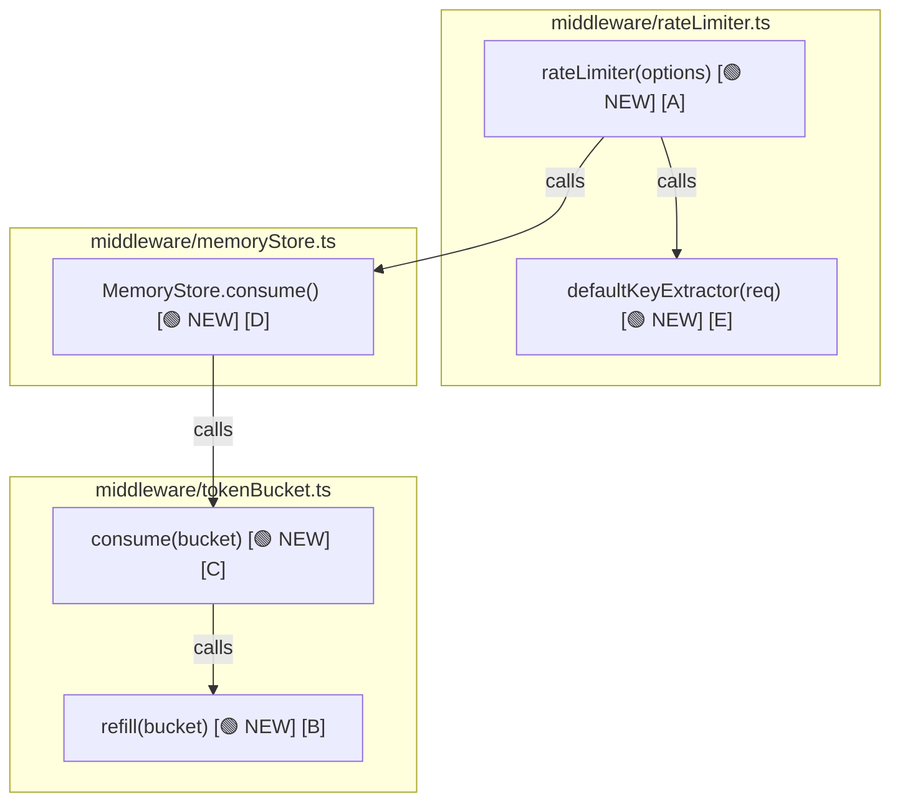
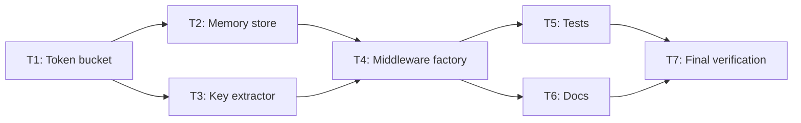

> **Note:** This is an example plan from the planning workflow.
> It shows what a full plan document can look like when expanded from an initial plan.
> Source plan: [`example-brainstorm-plan.md`](./example-brainstorm-plan.md)

---

# Plan: Per-User Rate Limiting Middleware

## Initial ask

Add per-user rate limiting middleware to the Express API. Each authenticated user gets a configurable request quota per time window using a token bucket algorithm. Exceeded quotas return HTTP 429 with standard rate limit headers.

## Problem statement

The API has no per-user request throttling. A single client can flood any endpoint, degrading service for all other users. This blocks the safe issuance of API keys to third-party developers.

## Solution overview

1. Token bucket middleware factory — configurable limit, window, and key extractor
2. In-memory per-user bucket store — no external dependencies
3. Standard rate limit headers on every response
4. Fail-open on unauthenticated requests
5. Single-call attachment to any Express route or router

## Functional requirements

- **F1.1. Limit enforcement**
  - Reject over-quota requests with HTTP 429
  - Applies per authenticated user within the configured window
- **F1.2. Rate limit headers**
  - Include standard headers on every response
  - Rejected responses also include `Retry-After`
- **F1.3. Configurable key**
  - Derive user key through configurable extractor
  - Default extractor reads JWT `sub`
- **F1.4. Configurable window**
  - Configure limit and window per middleware instance
  - Each attachment can use different quota settings
- **F1.5. Fail open**
  - Pass through requests without an extracted key
  - Applies when `keyExtractor` returns `null` or `undefined`
- **F1.6. Single-call attachment**
  - Attach middleware in one route-level call
  - Works on individual routes and routers
- **F1.7. Route isolation**
  - Leave untouched routes unaffected
  - Only attached routes are rate-limited

## Technical requirements

- **TR1.1. Token bucket**
  - Refill tokens continuously up to `limit`
  - Refill amount scales with elapsed time
- **TR1.2. In-memory store**
  - Store bucket state in `Map<string, BucketState>`
  - No Redis or external dependency in this iteration
- **TR1.3. JWT decoding**
  - Default extractor decodes JWT without verification
  - Returns `payload.sub` or `null` for invalid input
- **TR1.4. Factory interface**
  - `rateLimiter(options)` returns Express-compatible handler
  - Accepts custom `keyExtractor` and `store`

## Non-functional requirements

- **NF1.1. Request overhead**
  - Add less than 1 ms per request
  - Budget covers the bucket check path only
- **NF1.2. External dependencies**
  - Use in-memory state only this iteration
  - No network round trips on the hot path
- **NF1.3. Concurrency model**
  - Assume a single Node.js process
  - No locking required in this deployment model

## Technical constraints

- **TC1.1. Storage scope**
  - Do not use Redis or a database
  - This iteration stays in-memory only
- **TC1.2. Deployment model**
  - Do not support distributed deployments
  - Behaviour is limited to a single instance
- **TC1.3. Authenticated routes**
  - Apply only when a user key is extractable
  - Unauthenticated traffic is outside this middleware's scope

## Design considerations

- **DC1.1. Fail-open caveat**
  - Do not attach middleware to unauthenticated routes
  - F1.5 depends on authenticated routes providing a user key
- **DC1.2. Header exposure**
  - Expose rate limit headers by default
  - Helps clients back off gracefully
- **DC1.3. Bucket choice**
  - Prefer token bucket over sliding window
  - Simpler implementation with constant memory per user

## Out of scope

- IP-based rate limiting
- Persistent storage adapters
- Admin dashboard or monitoring
- Distributed / multi-instance coordination

## Call graph



## Data models

```ts
interface BucketState {
  tokens: number      // current count (float)
  lastRefill: number  // Unix ms of last refill
}
// Store: Map<string, BucketState>
```

```ts
interface RateLimiterOptions {
  limit: number
  windowMs: number
  keyExtractor?: (req: Request) => string | null
  store?: BucketStore
}
```

```ts
interface ConsumeResult {
  allowed: boolean
  remaining: number    // tokens left after request
  resetAt: number      // Unix ms when bucket fully refills
  retryAfter?: number  // seconds until next token (only when !allowed)
}
```

## Pseudocode breakdown

`[A]` **Middleware handler** — Request entry point

```sh
rateLimiter(options) → RequestHandler: # [🟢 NEW] [A]
  key = (options.keyExtractor ?? defaultKeyExtractor)(req)  # [E]
  if key is null → return next()
  result = store.consume(key, options)  # [D]
  setHeaders(res, result, options)
  if result.allowed → next()
  else → res.status(429).json(...)
```

`[B]` **Refill** — Replenish tokens based on elapsed time

```sh
refill(bucket, options, now): # [🟢 NEW] [B]
  tokensPerMs = options.limit / options.windowMs
  bucket.tokens = min(limit, bucket.tokens + (now - bucket.lastRefill) * tokensPerMs)
  bucket.lastRefill = now
```

`[C]` **Consume** — Refill, then deduct one token

```sh
consume(bucket, options, now): # [🟢 NEW] [C]
  refill(bucket, options, now)  # [B]
  if bucket.tokens >= 1:
    bucket.tokens -= 1
    return { allowed: true, remaining: floor(bucket.tokens) }
  else:
    return { allowed: false, retryAfter: ceil(...) }
```

`[D]` **Memory store** — Get or create, then persist

```sh
MemoryStore.consume(key, options): # [🟢 NEW] [D]
  bucket = map.get(key) ?? { tokens: options.limit, lastRefill: now }
  result = consume(bucket, options, now)  # [C]
  map.set(key, bucket)
  return result
```

`[E]` **Default key extractor** — JWT `sub` claim

```sh
defaultKeyExtractor(req): # [🟢 NEW] [E]
  token = req.headers.authorization?.split(' ')[1]
  payload = jwt.decode(token)  // no verification
  return payload?.sub ?? null
```

## Files

**New:** `src/middleware/rateLimiter.ts`, `src/middleware/tokenBucket.ts`, `src/middleware/memoryStore.ts`, `src/middleware/types.ts`, `src/middleware/rateLimiter.test.ts`, `src/middleware/tokenBucket.test.ts`, `src/middleware/memoryStore.test.ts`, `src/middleware/README.md`

## Testing strategy

**Run:** `npx vitest src/middleware/`

**Mocks:** None (in-memory; no I/O)

**Tests:**
- Token bucket: refill math, boundary at exactly 0 tokens, tokens never exceed limit, `retryAfter` accuracy
- MemoryStore: state persists across calls, new keys initialised at full limit
- Middleware: 200 on first N requests, 429 on N+1, correct headers, null key = pass-through, custom `keyExtractor`
- Integration (supertest): full Express app, route with/without middleware, window reset after `windowMs`

## Quality gates

```sh
npx vitest run
npx tsc --noEmit
npx eslint src/middleware/
```

## Ticket dependencies



## Tickets

### T1 — Core token bucket logic

**Description:** As a developer, I want pure token bucket functions so that rate limiting logic is testable in isolation.

**Acceptance criteria:**
- [ ] `BucketState`, `RateLimiterOptions`, `ConsumeResult` interfaces defined in `types.ts`
- [ ] `refill(bucket, options, now?)` mutates bucket in place [B]
- [ ] `consume(bucket, options, now?)` calls refill, returns `ConsumeResult` [C]
- [ ] No Express dependency
- [ ] `tokenBucket.test.ts` passes

---

### T2 — In-memory store

**Description:** As a developer, I want a `MemoryStore` class so that bucket state persists across requests per user.

**Acceptance criteria:**
- [ ] `Map<string, BucketState>` internal store
- [ ] `consume(key, options)` — get-or-create bucket, delegate to T1, persist [D]
- [ ] `clear()` — empties map (test helper)
- [ ] Bucket state persists across calls for same key

---

### T3 — Default key extractor

**Description:** As a developer, I want a default key extractor so that the middleware works out-of-the-box with JWT auth.

**Acceptance criteria:**
- [ ] Reads `Authorization: Bearer <token>` header
- [ ] Decodes JWT without verification via `jsonwebtoken.decode`
- [ ] Returns `payload.sub` as string, or `null` [E]
- [ ] Returns `null` for missing or malformed header

---

### T4 — Middleware factory

**Description:** As a developer, I want `rateLimiter(options)` so that I can attach rate limiting to any Express route in one call.

**Acceptance criteria:**
- [ ] Uses `MemoryStore` by default (or `options.store`)
- [ ] Uses `defaultKeyExtractor` by default (or `options.keyExtractor`)
- [ ] Null key → `next()` (fail open) [A]
- [ ] Sets `X-RateLimit-*` headers on every request
- [ ] Returns 429 + JSON body with `retryAfter` when limit exceeded
- [ ] Attaches to Express app in one line

---

### T5 — Tests

**Description:** As a developer, I want full test coverage so that behaviour is verified at all layers.

**Acceptance criteria:**
- [ ] Token bucket: refill math, boundary conditions, `retryAfter` accuracy
- [ ] MemoryStore: state persistence, initial bucket at full limit
- [ ] Middleware: 200 on first N requests, 429 on N+1, correct headers, null key pass-through, custom `keyExtractor`
- [ ] Integration (supertest): window reset after `windowMs`
- [ ] All tests pass

---

### T6 — Usage documentation

**Description:** As an API developer, I want a README so that I can quickly integrate the middleware.

**Acceptance criteria:**
- [ ] Install / import instructions
- [ ] Basic one-liner usage example
- [ ] Options reference table
- [ ] Custom `keyExtractor` example
- [ ] Known limitations: in-memory, single-instance only

---

### T7 — Final verification

**Description:** As a developer, I want all quality gates to pass so that the feature is production-ready.

**Acceptance criteria:**
- [ ] `npx vitest run` — all tests pass
- [ ] `npx tsc --noEmit` — no type errors
- [ ] `npx eslint src/middleware/` — no lint errors
- [ ] Remove TODO/debug comments from implementation
- [ ] JSDoc limited to 2 lines max where present
