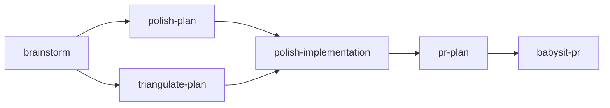

# Skills

## Skill map

## Skills reference

### Planning

- [`$brainstorm`](../skills/brainstorm/SKILL.md) — Develop a vague idea into a scoped, handoff-ready plan

### Refining

- [`$polish-plan`](../skills/polish-plan/SKILL.md) — Strengthen a plan via a subagent review loop, catching inaccuracies before execution
- [`$triangulate-plan`](../skills/triangulate-plan/SKILL.md) — Generate an independent second opinion on a plan and merge the best of both

### Implementing

- [`$polish-implementation`](../skills/polish-implementation/SKILL.md) — Iterative code review loop using a subagent; auto-applies fixes up to 3 passes

### Shipping

- [`$pr-plan`](../skills/pr-plan/SKILL.md) — Break an existing plan into smaller, reviewable pull requests
- [`$babysit-pr`](../skills/babysit-pr/SKILL.md) — Monitor a PR's CI status in a loop until it passes or needs human input
