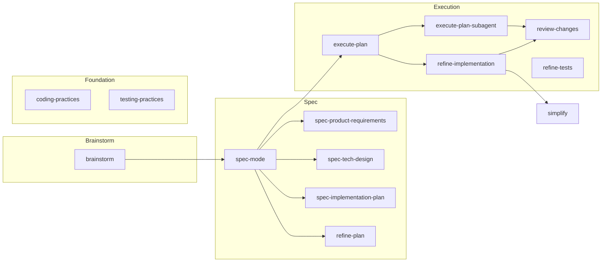

# Skills

## Skill map



## Skills reference

### Brainstorm

- [`$brainstorm`](../skill/atk/brainstorm/SKILL.md) — Develop a vague idea into a scoped, handoff-ready plan seed

### Spec

- [`$spec-mode`](../skill/atk/spec-mode/SKILL.md) — Guide interactive specification creation — requirements, design, tickets
- [`$spec-product-requirements`](../skill/atk/spec-product-requirements/SKILL.md) — Define functional/technical requirements sections
- [`$spec-tech-design`](../skill/atk/spec-tech-design/SKILL.md) — Define technical design — call graphs, data models, pseudocode
- [`$spec-implementation-plan`](../skill/atk/spec-implementation-plan/SKILL.md) — Break features into smaller, reviewable tickets
- [`$refine-plan`](../skill/atk/refine-plan/SKILL.md) — Refine a plan with subagents

### Execution

- [`$execute-plan`](../skill/atk/execute-plan/SKILL.md) — Execute a plan ticket-by-ticket using subagents
- [`$execute-plan-subagent`](../skill/atk/execute-plan-subagent/SKILL.md) — Execute a single ticket; used by `$execute-plan` subagents
- [`$refine-implementation`](../skill/atk/refine-implementation/SKILL.md) — Review and improve an implementation
- [`$review-changes`](../skill/atk/review-changes/SKILL.md) — Review code changes against a plan (P1/P2/P3 recommendations)
- [`$refine-tests`](../skill/atk/refine-tests/SKILL.md) — Identify redundant tests, coverage gaps, improvement opportunities

### Foundation

- [`$coding-practices`](../skill/atk/coding-practices/SKILL.md) — Core coding guidelines (functional core, result patterns, components)
- [`$testing-practices`](../skill/atk/testing-practices/SKILL.md) — Core testing guidelines (readability, quality, constants)

## Quick start 

Start with the brainstorm skill or command.

```
/brainstorm i want to implement config via c12 npm package
```
