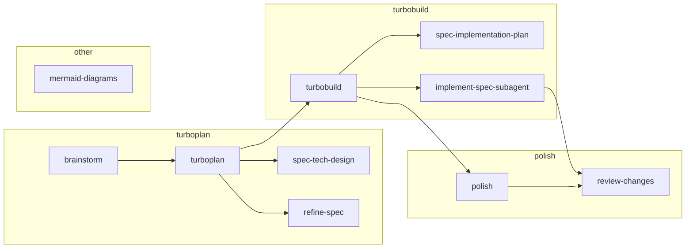

# Skills

## Skill map

## Skills reference

### pre-plan

- [`$brainstorm`](../skills/atk.brainstorm/SKILL.md) — Develop a vague idea into a scoped, handoff-ready plan seed

### turboplan

- [`$turboplan`](../skills/atk.turboplan/SKILL.md) — Expand an approved pre-plan with technical design, then refine it
  - [`$spec-tech-design`](../skills/atk.spec-tech-design/SKILL.md) — Define technical design — call graphs, data models, pseudocode
  - [`$refine-spec`](../skills/atk.refine-spec/SKILL.md) — Pressure-test a spec or plan seed with independent critiques

### turbobuild

- [`$turbobuild`](../skills/atk.turbobuild/SKILL.md) — Strengthen ticket planning when needed, then implement a spec ticket-by-ticket
  - [`$spec-implementation-plan`](../skills/atk.spec-implementation-plan/SKILL.md) — Break features into smaller, reviewable tickets
  - [`$implement-spec-subagent`](../skills/atk.implement-spec-subagent/SKILL.md) — Implement a single ticket; used by `$turbobuild` subagents

### polish

- [`$polish`](../skills/atk.polish/SKILL.md) — Simplify and review an implementation
  - [`$review-changes`](../skills/atk.review-changes/SKILL.md) — Review code changes against the spec (P1/P2/P3 recommendations)

### other

- [`$spec-product-requirements`](../skills/atk.spec-product-requirements/SKILL.md) — Define functional/technical requirements sections
- [`$mermaid-diagrams`](../skills/atk.mermaid-diagrams/SKILL.md) — Create Mermaid diagrams and fix Mermaid syntax issues
