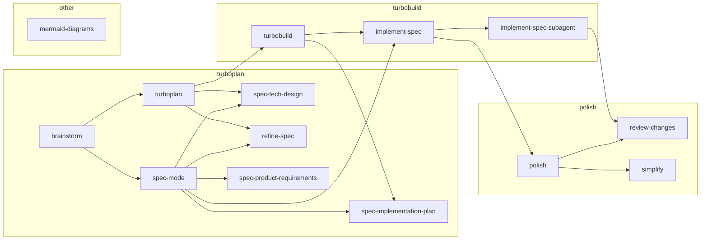

# Skills

## Skill map



## Skills reference

### turboplan

- [`$turboplan`](../skills/atk.turboplan/SKILL.md) — Expand an approved pre-plan with technical design, then refine it
- [`$brainstorm`](../skills/atk.brainstorm/SKILL.md) — Develop a vague idea into a scoped, handoff-ready plan seed
- [`$spec-mode`](../skills/atk.spec-mode/SKILL.md) — Guide interactive specification creation — requirements, design, tickets
- [`$spec-product-requirements`](../skills/atk.spec-product-requirements/SKILL.md) — Define functional/technical requirements sections
- [`$spec-tech-design`](../skills/atk.spec-tech-design/SKILL.md) — Define technical design — call graphs, data models, pseudocode
- [`$spec-implementation-plan`](../skills/atk.spec-implementation-plan/SKILL.md) — Break features into smaller, reviewable tickets
- [`$refine-spec`](../skills/atk.refine-spec/SKILL.md) — Pressure-test a spec or plan seed with independent critiques

### turbobuild

- [`$turbobuild`](../skills/atk.turbobuild/SKILL.md) — Expand a plan into tickets and run implementation
- [`$implement-spec`](../skills/atk.implement-spec/SKILL.md) — Implement a spec ticket-by-ticket using subagents
- [`$implement-spec-subagent`](../skills/atk.implement-spec-subagent/SKILL.md) — Implement a single ticket; used by `$implement-spec` subagents

### polish

- [`$polish`](../skills/atk.polish/SKILL.md) — Simplify and review an implementation
- [`$review-changes`](../skills/atk.review-changes/SKILL.md) — Review code changes against the spec (P1/P2/P3 recommendations)
- [`$simplify`](../skills/atk.simplify/SKILL.md) — Simplify an implementation before final review

### other

- [`$mermaid-diagrams`](../skills/atk.mermaid-diagrams/SKILL.md) — Create Mermaid diagrams and fix Mermaid syntax issues

## Quick start 

Start with the brainstorm skill or command.

```
/brainstorm i want to implement config via c12 npm package
```

## Examples

Concrete examples of skill outputs using a rate-limiting middleware scenario:

- [`example-seed.md`](./example-seed.md) — example plan seed produced by `$brainstorm`
- [`example-spec.md`](./example-spec.md) — example full spec (PRD + TDD + tickets) produced by `$spec-mode`
