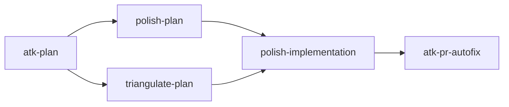

# Skills

## Skill map

```mermaid
graph LR
  atk_plan["atk-plan"] --> polish_plan["polish-plan"]
  atk_plan["atk-plan"] --> triangulate_plan["triangulate-plan"]
  polish_plan --> polish_implementation["polish-implementation"]
  triangulate_plan --> polish_implementation
  polish_implementation --> atk_pr_autofix["atk-pr-autofix"]
```

## Skills reference

### Planning

- [`$atk-plan`](../skills/atk-plan/SKILL.md) — Turns a rough idea into an actionable plan: judgement calls instead of interviewing, every call documented under `## Decisions` for veto at review
- [`$metaplan`](../skills/metaplan/SKILL.md) experimental — Living notebook for multi-slice projects spanning multiple tickets/PRs

### Refining

- [`$polish-plan`](../skills/polish-plan/SKILL.md) — Strengthen a plan into an implementation-ready plan via a subagent review loop, catching inaccuracies before execution
- [`$triangulate-plan`](../skills/triangulate-plan/SKILL.md) — Generate an independent second opinion on a plan and merge the best of both into an implementation-ready plan

### Implementing

- [`$polish-implementation`](../skills/polish-implementation/SKILL.md) — Iterative code review loop against a GitHub PR; self-review threads get fixed, replied to, and resolved, up to 10 passes

### Shipping

- [`$atk-pr-autofix`](../skills/atk-pr-autofix/SKILL.md) — Monitor a PR's CI status in a loop until it passes or needs human input
