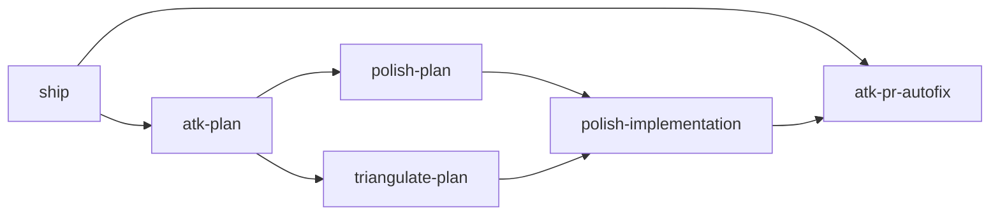

# Skills

## Skill map

```mermaid
graph LR
  ship["ship"] --> atk_plan["atk-plan"]
  ship --> atk_pr_autofix["atk-pr-autofix"]
  atk_plan --> polish_plan["polish-plan"]
  atk_plan --> triangulate_plan["triangulate-plan"]
  polish_plan --> polish_implementation["polish-implementation"]
  triangulate_plan --> polish_implementation
  polish_implementation --> atk_pr_autofix
```

## Skills reference

### Orchestration

- [`$ship`](../skills/ship/SKILL.md) — Runs an open-ended request through the whole pipeline unattended: reframe → plan → implement → polish → CI, in a worktree and branch with a draft PR

### Planning

- [`$atk-plan`](../skills/atk-plan/SKILL.md) — Turns a rough idea into an actionable plan: judgement calls instead of interviewing, every call documented under `## Decisions` for veto at review

### Refining

- [`$polish-plan`](../skills/polish-plan/SKILL.md) — Strengthen a plan into an implementation-ready plan via a subagent review loop, catching inaccuracies before execution
- [`$triangulate-plan`](../skills/triangulate-plan/SKILL.md) — Generate an independent second opinion on a plan and merge the best of both into an implementation-ready plan

### Implementing

- [`$polish-implementation`](../skills/polish-implementation/SKILL.md) — Iterative code review loop against a GitHub PR; self-review threads get fixed, replied to, and resolved, up to 10 passes

### Shipping

- [`$atk-pr-autofix`](../skills/atk-pr-autofix/SKILL.md) — Monitor a PR's CI status in a loop until it passes or needs human input
- [`$pr-review-guide`](../skills/pr-review-guide/SKILL.md) — Reviewer walkthrough narrative: call graph, chapters, sequence diagrams, decision points
- [`$trim-tests-and-comments`](../skills/trim-tests-and-comments/SKILL.md) — Reports, then cuts, weak tests and low-value comments added on the branch
- [`$deslop-prose`](../skills/deslop-prose/SKILL.md) — Flags AI-sounding prose, clichés, filler, and unnatural phrasing in added prose and code comments
- [`$minimise-pr-comments`](../skills/minimise-pr-comments/SKILL.md) — Hides low-signal PR comments and reviews (bot noise, superseded review passes) while keeping signal

### Reviewing

- [`$atk-code-review`](../skills/atk-code-review/SKILL.md) — Structured code review that posts findings as GitHub PR review threads (or plain text when no PR exists)
- [`$pr-risk-assessment`](../skills/pr-risk-assessment/SKILL.md) — Rates PRs on a 5-level risk scale to triage how carefully they need reviewing

## Optional dependencies

Used when present, with fallbacks otherwise:

- `$pr-description` external — PR title/body guidelines for `$ship`; a plain summary is written when it is missing
- `$impact-analysis` external — production-data estimates for `$ship`; the analysis is skipped when it is missing
- `$worktrunk` external — worktree management for `$ship`'s implement-plan.md; plain `git worktree add` otherwise
- [`$skimmable`](https://github.com/rstacruz/skimmable) external — formatting guidelines for `$ship`, `$atk-plan`, and `$atk-code-review`

## Make them your own

These skills are starting points, not sealed products: copy them into your setup and rewrite them for your conventions, tooling, and review process. The [optional dependencies](#optional-dependencies) above are the most personal of the lot — write your own versions of those rather than importing mine.
