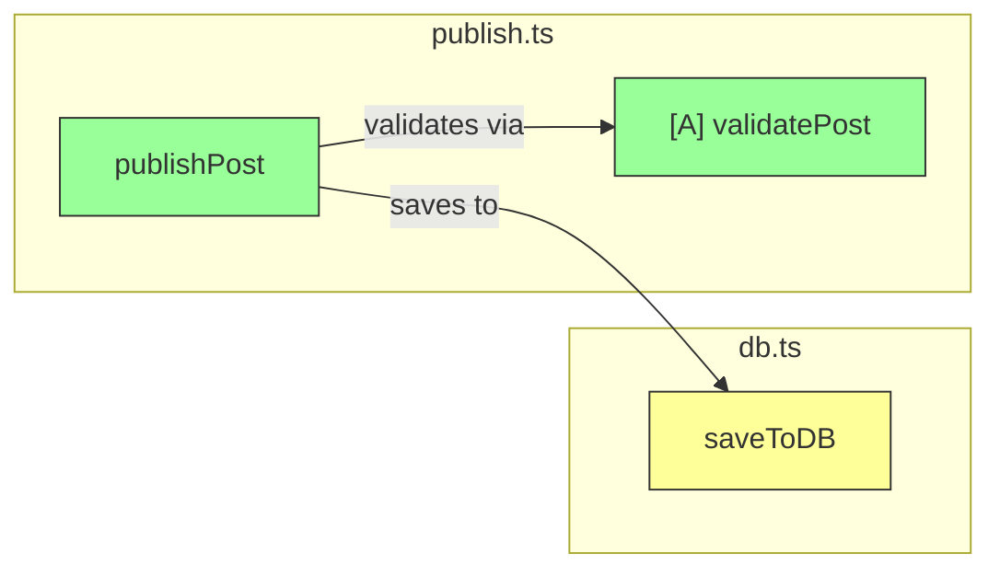

# Explain Code

Guidelines for explaining code with call graphs and pseudocode.

**Use when:** Explaining features, functions, logic flow, creating documentation, onboarding

## Example: Explain login flow

> **User:** Explain how login works
>
> **Agent:**
> ```mermaid
> graph LR
>   A["POST /api/login"] --> B["validateCredentials"]
>   B --> C["generateToken"]
>   C --> D["createSession"]
> ```
>
> ```sh
> # == auth/login.ts ==
>
> handleLogin(email, password)
>   → validateCredentials(email, password)
>   → user = findUserByEmail(email)
>   → compare(password, user.password_hash)
>   → generateToken(user.id)
>   → createSession(token, user.id)
>   → return { token }
> ```

## Example: Complex feature

> **User:** Show how blog publishing works
>
> **Agent:** (Produces call graph) (Writes detailed pseudocode with multiple functions) (Cross-references with [A], [B] labels)

## Call graph format

- Use `graph LR` for Mermaid
- Color code: green (new), yellow (updated), red (removed)
- Reference letters `[A]`, `[B]` to link with pseudocode
- Trace to entry points (API routes, handlers)



## Pseudocode format

- Simplified logic flow with file locations
- Reference letters `[A]`, `[B]` for cross-referencing
- Mark changes: `[🟢 NEW]`, `[🟡 UPDATED]`, `[🔴 REMOVED]`
- Use `sh` syntax highlighting

```sh
# == blog/publish.ts ==

publishPost(post) # [🟢 NEW]
  → validatePost(post) # [🟢 NEW: checks required fields]
  → saveToDB(post) # [🟡 UPDATED: supports tags]
  → notifySubscribers(post)

[A] validatePost(post)
  if !post.title: throw error
  if post.content.length < 100: throw error
```

**Related:** [`analyse-and-review-pr`](../analyse-and-review-pr/), [`mermaid-diagrams`](../mermaid-diagrams/)
