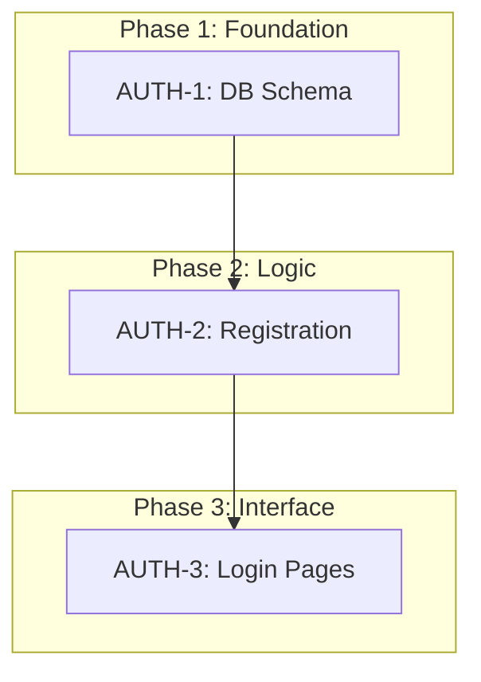

# Create a feature roadmap

## When to use

- Large features requiring phased delivery
- Features with multiple interconnected tasks
- Work spanning multiple sprints
- Need to visualize dependencies and sequencing

## When NOT to use

- Single straightforward tasks
- Well-defined sequential work without dependencies
- Features already broken down in TDD

## Process

When user requests a roadmap, follow these steps sequentially:

0. Acknowledge before starting: **Now creating a delivery roadmap.**
1. **Context gathering:** Read existing PRD/TDD/Discovery docs. Search codebase for relevant patterns.
2. **Clarifying questions:** Identify constraints, capacity, risks. Ask user with recommended solutions.
3. **Break down work:** Identify tasks, assign feature-specific IDs, group into phases, map dependencies.
4. **Create roadmap:** Follow structure and guidelines below.
5. **Validate dependencies:** Ensure no circular dependencies, foundational work precedes dependent work.
6. **Save:** Write to `artefacts/roadmap-<feature-slug>.md`.

## Roadmap document structure

Generated roadmap files should include:

- **Document title and summary** — Brief overview of the feature and roadmap purpose
- **Dependency diagram** — Mermaid graph showing tasks grouped by phase with dependencies
- **Work breakdown** — Detailed task descriptions organized by phase
- **Technical considerations** — Critical implementation notes, session bridges, atomic operations
- **Related documents** — Links to PRD, TDD, Discovery docs (if applicable)

## Task identification guidelines

**Task ID format:**
- Use feature-specific prefixes (AUTH, UI, API, DB, etc.)
- Number sequentially within each prefix (AUTH-1, AUTH-2, etc.)
- Keep prefixes short (2-5 characters)
- Choose meaningful prefixes reflecting the work domain

**Task naming:**
- Use concise, action-oriented names (e.g., "DB schema update", not "Update the database schema")
- Focus on deliverable, not implementation details
- Each task should be independently testable/verifiable

## Dependency diagram guidelines

**Structure rules:**
- Group tasks into `subgraph` blocks representing phases
- Label subgraphs as "Phase 1: Foundation", "Phase 2: Logic", etc.

**Best practices:**
- Keep phases focused (3-5 tasks per phase ideal)

## Work breakdown guidelines

**Format:**
```markdown
### Phase N: Phase Name
*   **TASK-ID: Task Title**
    *   Bullet point describing what needs to be done
    *   Additional implementation notes
    *   Technical constraints or requirements
```

**Writing style:**
- Use imperative verbs (Add, Implement, Create, Update, Refactor)
- Include specific details (file names, function names, model fields)
- Mention tools/libraries when relevant
- Note compatibility requirements
- Call out transaction boundaries or atomicity needs

**Level of detail:**
- Enough for a developer to understand scope
- Not full implementation pseudocode (that's TDD territory)
- Focus on *what* and *why*, not detailed *how*

## Phasing strategy

**Principles:**
1. Foundation first - enable downstream work
2. Logic second - core functionality
3. Migration third - data handling
4. Interface last - user experience

**Considerations:**
- Can early phases be deployed without breaking production?
- Which tasks enable the most parallel work downstream?
- What's the minimum viable Phase 1 that unblocks everything else?

## Validation checklist

Before finalizing:
- [ ] No circular dependencies, all dependencies point forward
- [ ] All PRD requirements covered
- [ ] Each phase independently deployable

## Example roadmap

````markdown
# Roadmap: User authentication

## Dependency diagram



## Work breakdown

### Phase 1: Foundation
*   **AUTH-1: DB Schema**
    *   Add `email`, `passwordHash` to User model
    *   Generate migration with Prisma

### Phase 2: Logic
*   **AUTH-2: Registration**
    *   Server Action for user creation
    *   Validate email uniqueness, password complexity

### Phase 3: Interface
*   **AUTH-3: Login Pages**
    *   Build `/signup` and `/login` routes
    *   Form validation and error states

## Technical considerations

- **Compatibility:** Ensure bcrypt works with `nodejs_compat` mode
````
