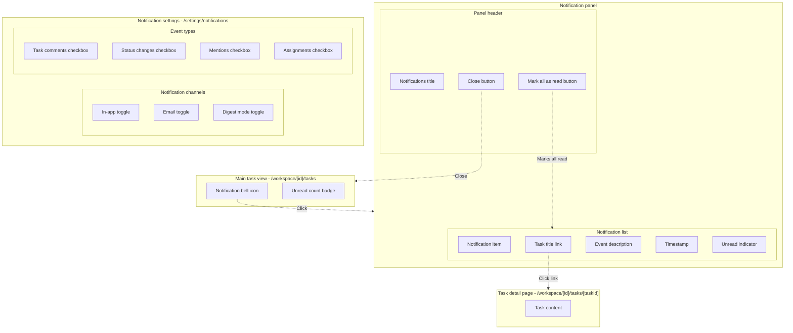
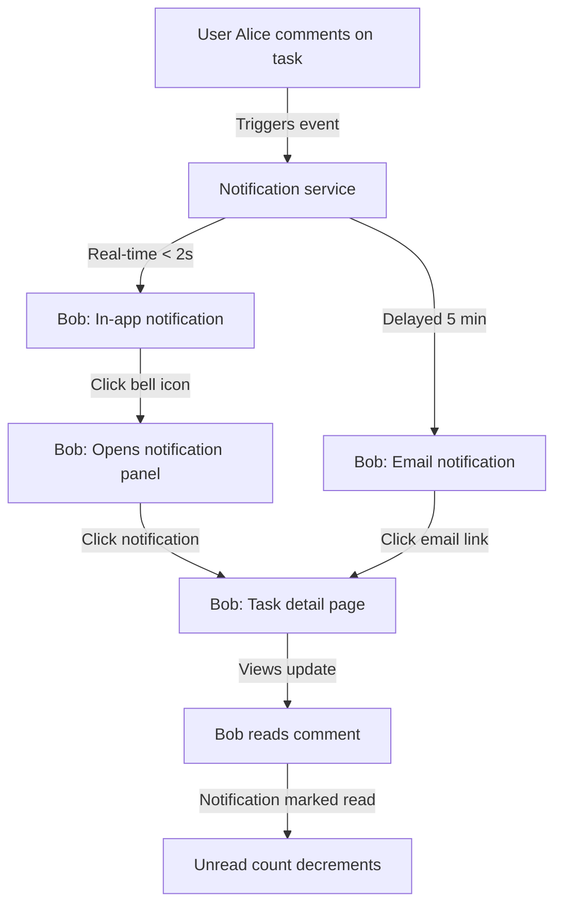

<guidelines>

## User actions

**Common user requests:**
- "Write a PRD for [feature]" → See [Draft or write a PRD](#draft-or-write-a-prd)
- "Draft a TDD for [feature]" → See [Write a TDD](#write-a-tdd)
- "Plan a code change" → See [Write a TDD](#write-a-tdd)
- "Research [topic/technology/approach]" → See [Research a topic](#research-a-topic)

The user may ask for these tasks.

### Draft or write a PRD

When user requests a PRD, follow these steps sequentially:

0. Acknowledge before starting: **Now writing a PRD.**
1. **Codebase research:** Understand existing systems and constraints that impact the feature. Write findings to `artefacts/discovery-<title>.md` if research reveals non-obvious constraints, quirks, or patterns that would impact planning.
2. **Context alignment:** Check `artefacts/discovery-<title>.md` for environmental context (if exists).
3. **Clarifying questions:** Identify ambiguities or missing requirements before drafting. Ask user with recommended solutions. See *Open questions guidelines*.
4. **Draft PRD:** Follow the PRD structure and guidelines described in the "PRD guidelines" section below.
5. **Document remaining questions:** Add unresolved questions to the PRD's "Open questions" section.
6. **Document persistence:** Write to `artefacts/prd-{slug}.md` unless otherwise specified.

### Write a TDD

When user requests a TDD, follow these steps sequentially:

0. Acknowledge before starting: **Now writing a TDD.**
1. **Codebase research:** Search for relevant code patterns, existing data models, and integration points. Write findings to `artefacts/discovery-<title>.md` if research reveals non-obvious constraints, quirks, or patterns that would impact implementation.
2. **Context alignment:** Check `artefacts/prd-{slug}.md` and `artefacts/discovery-<title>.md` to ensure the design adheres to requirements and environmental constraints.
3. **Clarifying questions:** Identify ambiguities or missing technical decisions that would significantly impact the design. Ask user before proceeding with recommended solutions.
4. **Draft design:** Follow the TDD structure and guidelines described in the "TDD guidelines" section below.
5. **Document remaining questions:** Add any unresolved implementation-specific open questions to the TDD with proposed solutions.
6. **Document persistence:** Write the final design to `artefacts/tdd-<feature>.md`.

### Research a topic

When researching a topic, write findings to the Discovery Document (`artefacts/discovery-<title>.md`).

## Planning artefacts

### Document structure

Project planning uses these artefacts in `artefacts/` (local, git-ignored):

- Discovery documents (`discovery-<title>.md`) - environmental context and constraints
- Product requirements document (PRD, `prd-{slug}.md`) - product requirements
- Technical design document (TDD, `tdd-<feature>.md`) - implementation plans

Notes persist in `notes/` across branches. Users may specify custom locations.

**Guidelines:**

- Write artefacts to `artefacts/` folder (eg, `artefacts/prd-{slug}.md`)
- Make judgement calls on scope:
  - Large projects: discovery, PRD, TDD
  - Small tasks: TDD only
- Confirm with user before proceeding from PRD to TDD

### Multiple planning tracks

When users request work outside the current scope:

- New feature/scope: Create new TDD (e.g., `tdd-another-feature.md`)
- New research question: Create new discovery (e.g., `discovery-api-quirks.md`)

## Discovery document guidelines

**Purpose:** capture environmental constraints and context needed for planning, NOT implementation details or obvious information.

The document should answer: "What do I need to know about the environment to make good planning decisions?". It should not answer: "How will I implement this?", that's the TDD's job.

Typical inclusions:

- Current system architecture and patterns
- Existing code structures that must be followed
- Technical constraints and limitations
- Database schemas and data formats
- Third-party APIs and their quirks
- Non-obvious edge cases with business impact
- Library research (capabilities, usage patterns, tradeoffs)

Typical exclusions:

- Implementation pseudocode or code samples (belongs in TDD)
- Obvious edge cases (e.g., "React handles HTML escaping")
- Migration strategies and rollback plans (belongs in TDD)
- Backwards compatibility solutions (belongs in TDD)
- "Next steps" or implementation order (belongs in TDD)
- Test cases and testing strategy (belongs in TDD)
- Effort estimates and timelines (belongs in PRD roadmap)

### Condensed summary

Include a "condensed summary" H2 at the beginning of discovery documents.

In it, write a condensed prompt to guide future LLM agents to do their own codebase research and be able to come up to the same conclusions as what's stated in the rest of the document.

Aim for minimum tokens.

Prefer to show citations to the code rather than examples and long explanations. The goal is to empower agents to find this information independently.

Consider if it needs to include:

- Context (required) - short summary of the ask
- Function and symbol names (with code locations)
- Glossary
- Issues found
- Key insights

### Discovery vs TDD

Use this test: "Would this information still be true if we chose a completely different implementation approach?"

- If YES → Discovery (e.g., "Database uses SQLite", "Tailwind v4 has no config file")
- If NO → TDD (e.g., "Use buildPrompt() function", "Handle errors with try/catch")

### Patterns to avoid

- Avoid documenting obvious behaviors ("React handles HTML escaping by default", "UTF-8 characters work in database")
- Avoid including implementation details ("Use try/catch for error handling")

## PRD guidelines

A PRD typically has these sections. Some may be present or absent depending on the situation.

- **Initial ask** (required) — Restatement of the original user request. Update as needed based on clarifications.
- **Problem statement** — Current pain points and issues the feature will address.
- **Solution overview** — High-level summary of the proposed solution (numbered list of key capabilities).
- **Functional requirements** — Detailed feature requirements using hierarchical IDs (F1, F1.1, F1.2). Use compact bullet format with em-dashes.
- **Non-functional requirements** — Performance, accessibility, scalability requirements (NF1, NF2...). Use compact bullet format.
- **Technical constraints** — Technology stack, integration, and implementation constraints (TC1, TC2...). Use compact bullet format.
- **Design considerations** — Important design decisions and implementation notes (DC1, DC2...). Use compact bullet format.
- **Screen interactions** — Mermaid diagram showing UI structure, components, and navigation flows. Include "Key entities" subsection listing pages/URLs, UI components, and API endpoints.
- **User flow** — Mermaid diagram showing end-to-end user journey through the feature.
- **Open questions** — Clarifying questions with recommended solutions and alternatives.
- **Out of scope** — Features deferred for future consideration.
- **Additional context** — Environmental information, existing systems, and research findings.

Good PRD qualities:

- A technical solution plan can be made from it
- Edge cases and error scenarios are addressed
- Engineers can estimate the work without asking too many questions

### Functional requirements

Use concise bullet format for readability:

- Give ID's to requirements (e.g., F1, F1.1, F1.2)
- Use em-dashes (—) to separate requirement name from description
- Keep descriptions brief and action-oriented
- Group related requirements under descriptive headings
- Add context after the bullet list if needed

See "PRD example" for examples.

**Formatting guidelines:**

- Omit user stories unless they add essential context
- Avoid wordy phrases like "Users must be able to", "System must support"
- Use active, direct language
- Include timing/constraints inline with requirements
- Keep additional context separate from the main requirements list

**Apply same format to:**

- Non-functional requirements (NF1, NF2...)
- Technical constraints (TC1, TC2...)
- Any other requirement lists

### Design considerations

Document important design decisions that don't fit neatly into functional requirements. See example.

### Screen interactions diagram

For PRDs with UI components, include a screen interactions diagram showing how users navigate between screens and interact with UI elements.

**Purpose:** Visualise the UI structure, component hierarchy, and interactive flows to help engineers understand the frontend implementation scope.

**When to include:**

- PRDs with multiple screens or views
- Features with complex user interactions
- Features requiring UI component design

**Structure rules:**

1. **Top-level subgraphs:** Represent screens/pages/views with URL paths in the label
2. **Nested subgraphs:** Group related UI elements (e.g., "Panel header", "Form actions", "Navigation bar")
3. **Nodes:** Individual UI elements (buttons, links, inputs, indicators)
4. **Dashed arrows (`-.->`)**: Show user interactions and navigation between screens/elements
5. **Arrow labels:** Describe the action (e.g., "Click", "Opens", "Navigates to", "Closes")

**What to include:**

- Screens and their URLs
- Interactive elements (buttons, links, dropdowns, toggles)
- Component groupings (headers, forms, navigation)
- Navigation flows between screens
- Modal/drawer/panel open/close interactions

**What to exclude:**

- Non-interactive elements (static text, images, decorations)
- Internal component hierarchy (keep it flat within subgraphs)
- Detailed styling information
- Data flow (this is for UI interaction, not data)

**Best practices:**

- Use quoted labels: `["Element name"]`
- Use descriptive subgraph identifiers: `subgraph MainView["Main view"]`
- Keep nesting to 2-3 levels maximum
- Focus on user-facing interactions, not technical implementation
- Use consistent naming for similar interaction types
- Group related elements together in nested subgraphs

**After the diagram, include a "Key entities" subsection:**

List relevant pages/URLs, UI components, and API endpoints related to the screen interactions.

### User flow diagram

For PRDs with multi-step processes or cross-user interactions, include a user flow diagram showing the end-to-end journey through the feature.

**Purpose:** Illustrate the sequential flow of actions, system responses, and state changes from a user's perspective. Shows both user actions and system behaviour.

**When to include:**

- Features with multi-step processes
- Features involving multiple users or roles
- Features with asynchronous operations (notifications, background jobs)
- Features with complex conditional logic or branching paths

**Structure rules:**

1. **Nodes:** Represent states, actions, or events in the user journey
2. **Solid arrows (`-->`)**: Show sequential flow and causality
3. **Arrow labels:** Describe the trigger, condition, or action
4. **System nodes:** Include backend/system processes when relevant to understanding the flow

**What to include:**

- User actions (clicks, inputs, navigation)
- System responses (notifications, data updates, state changes)
- Different user perspectives when feature involves collaboration
- Conditional branches for important decision points

**What to exclude:**

- Implementation details (API endpoints, function names)
- Error handling flows (unless critical to understanding)
- UI component specifics (that belongs in Screen interactions)
- Technical architecture (that belongs in TDD)

**Best practices:**

- Keep nodes concise (5-8 words maximum)
- Highlight async operations and parallel flows
- Use consistent verb tenses (present tense for actions)

### PRD example

````markdown
# PRD: Task notification system

## Initial ask

Add a notification system to inform users about task updates in real-time and via email.

## Problem statement

Users currently have no way to be notified when tasks are updated. They must manually check the task list to discover changes, leading to:

- Missed important task updates
- Delayed responses to status changes
- No awareness of task comments or mentions
- Difficulty staying synchronized with team progress

## Functional requirements

### F1: Notification events

Users receive notifications for these events:

- **F1.1. Task comments** — When someone comments on a watched task
- **F1.2. Status changes** — When task status changes
- **F1.3. Mentions** — When mentioned in comments or descriptions
- **F1.4. Task assignments** — When a task is assigned to them

Each notification includes: event type, task title (linked), who triggered it, change info, timestamp.

### F2: Notification delivery

Notification delivery channels:

- **F2.1. Real-time notifications** — In-app notifications within 2 seconds of the event
- **F2.2. Email notifications** — Email notifications within 5 minutes of the event
- **F2.3. Notification center** — View all notifications in a dedicated panel
- **F2.4. Unread indicator** — Show unread notification count on notification bell icon

## Non-functional requirements

- **NC1.1. Performance** — Real-time notifications delivered within 2 seconds

## Technical constraints

- **TC1. Database** — Use existing PostgreSQL database with Prisma ORM
- **TC2. Authentication** — Integrate with current NextAuth session management

## Design considerations

- **DC1. No backward compatibility** — New implementation replaces legacy system entirely
- **DC2. Separate personal and business contacts** — Keep distinct data models for each type

## Screen interactions



### Key entities

**Pages and URLs:**

- `/workspace/[id]/tasks` - Main tasks view with notification bell
- `/workspace/[id]/tasks/[taskId]` - Task detail page
- `/settings/notifications` - Notification preferences page

**UI components:**

- Notification bell icon (top navigation)
- Notification panel (slide-out drawer)
- Notification item (list item in panel)
- Unread badge (notification count indicator)

**API endpoints:**

- `GET /api/notifications` - Fetch notifications
- `PATCH /api/notifications/[id]/read` - Mark notification as read
- `PATCH /api/notifications/mark-all-read` - Mark all as read
- `GET /api/user/notification-preferences` - Get preferences
- `PATCH /api/user/notification-preferences` - Update preferences

## User flow



## Out of scope

The following features are deferred for future consideration:

- Slack/Discord integration for notifications
- Mobile push notifications
- Browser push notifications (desktop)
- Notification analytics and reporting

## Open questions

1. **Root page:** Should the root `/` page redirect to a default language (e.g., `/es`), or remain separate?

   - a. Redirect to `/es` based on browser language detection _(recommended)_
   - b. Show a language selection landing page

2. **Default role:** What should be the default user role upon registration?

   - a. Basic user with limited permissions _(recommended)_
   - b. Trial user with time-limited premium features
````

## TDD guidelines

### TDD structure

Use a single `tdd-<feature>.md` file for all projects.

Include if applicable:

- **Call graph:**
  - (if applicable) See "### Call graph" below
- **Pseudocode breakdown:**
  - (if applicable) See "### Pseudocode breakdown" below
- **Data models:**
  - (if any) Types, interfaces, schemas, and data structures
- **Files:**
  - (if applicable) New, modified, removed files. Include reference/context files for LLM agents to understand existing patterns
- **CSS classes:**
  - (if any) Styling and layout classes needed. List class names only - no definitions, no Tailwind utilities, no CSS code.
- **Testing strategy:**
  - (if applicable, and if user asked for it) see "### Testing strategy" below
- **Open questions:**
  - (if applicable) Clarifying questions for ambiguous implementation details
  - See "Open questions guidelines" section

Keep it concise:

- Omit sections that don't add value for the specific task
- List items rather than define them when appropriate (e.g., CSS classes)

### Call graph

A call graph visualises how functions, modules, and systems interconnect. Use this to explain complex multi-component implementations.

**When to include:**

- Multiple inter-connected functions across files
- Complex module dependencies
- System integration points
- Architectural changes affecting multiple components

**Structure rules:**

1. **Subgraphs:** Group related components by file or module
2. **Nodes:** Individual functions, components, or modules
3. **Reference letters:** Add `[A]`, `[B]`, etc. to correlate with pseudocode
4. **Status markers:** Highlight changes with colour-coded classes:
   - Green (`.new`): New components
   - Yellow (`.updated`): Modified components
   - Red (`.removed`): Removed components
5. **Arrows:** Show relationships (uses, calls, renders, configured with)
6. **Quote all labels:** Use `["label"]` syntax to avoid issues with special characters

**What to include:**

- New, modified, and removed functions/components
- References to what uses new/updated components (search repo if needed)
- Key integration points between components
- Data flow direction when relevant

**What to exclude:**

- Internal implementation details (save for pseudocode)
- Trivial helper functions unless they're central to understanding
- Standard library or framework functions
- Tests

**Best practices:**

- Keep graph focused on changed components and their immediate dependencies
- Use descriptive arrow labels ("uses", "calls", "renders via", "configured with")
- Search codebase to find what uses new/updated components, even if not part of current changes. Trace it back to the entry points if possible (eg, API calls, CLI actions) - search repo as needed
- Correlate graph nodes to pseudocode sections using reference letters

### Pseudocode breakdown

Break down the core logic into pseudocode showing flow and key components. See the [Example TDD](#example-tdd) for the recommended format.

- Add reference letters like `[A]` and `[B]` to make it easier to find connections
- Mark `[🟢 NEW]` or `[🟡 UPDATED]` or `[🔴 REMOVED]` where necessary
- Use "sh" for syntax highlighting language, even if the syntax is not shell
- If any specific function/file is not updated/removed, leave it out
- Include descriptive comments to explain the logic flow and business rules
- Keep JSX/markup minimal: use high-level component references, not full JSX trees
- Focus on logic flow, not rendering details
- Use `→ render <Component>` rather than showing JSX structure

**Example: Avoid verbose JSX with nested tags**

```sh
# AVOID: Too verbose
renderNotificationPanel()
  → notifications = getUnreadNotifications()
  → return (
      <div className="fixed right-0 w-96 shadow-lg">
        <div className="border-b p-4">
          <h2>Notifications</h2>
            ... [skip]

# PREFER: Concise and logic-focused
renderNotificationPanel()
  → notifications = getUnreadNotifications()
  → render <NotificationPanel notifications={notifications}>
      <h2>Notifications</h2>
      {/* for each notification: */}
        <Notification ...>
    </>
```

### Testing strategy

List any unit, integration, and other tests needed. Include test commands to run individual test files. See the [Example TDD](#example-tdd) for the recommended format.

- List test data and test fixtures that will be used. This allows reviewers to gauge how complex the test file will be
- List what dependencies need mocking and why (external APIs, databases, time-dependent functions)
- Be EXTREMELY conservative: plan for the minimum amount of tests (e.g., a single smoke test)
- Include the exact command to run the relevant tests

### Example TDD

````markdown
# TDD: Task completion tracker

## Initial ask

Add a task completion feature that marks tasks as done with a timestamp.

## Data models

```typescript
interface Task {
  id: string;
  title: string;
  status: "pending" | "completed";
  completedAt: Date | null;
}
```

## Pseudocode breakdown

**completeTask:** mark task complete

```sh
# == tasks/complete.ts ==

completeTask(taskId) # [🟢 NEW]
  # Validate task exists
  → task = prisma.task.findUnique({ where: { id: taskId } })
  if !task:
    → log "Task not found"
    → return { ok: false, error: "NOT_FOUND" }

  # Check if already completed
  if task.status == 'completed':
    → log "Already completed"
    → return { ok: true, task }

  # Mark complete and persist
  → prisma.task.update({
      where: { id: taskId },
      data: { status: 'completed', completedAt: new Date() }
    })
  → return { ok: true, task }
```

## Files

**New files:**

- `src/tasks/complete.ts`

**Modified files:**

- `prisma/schema.prisma` - Add Task model

## Files

**New files:**

- `src/tasks/complete.ts`

**Modified files:**

- `prisma/schema.prisma` - Add Task model

## CSS classes

- `.task-item` - Task container
- `.task-checkbox` - Completion checkbox
- `.task-completed` - Completed state styling

## Testing strategy

### Running tests

- `npx vitest src/tasks/complete.test.ts`

### complete.test.ts

```typescript
// Mocks
vi.mock("@/lib/prisma");

// Test data
const PENDING_TASK = { id: "1", title: "Test", status: "pending", completedAt: null };
const COMPLETED_TASK = { id: "2", title: "Done", status: "completed", completedAt: new Date() };

describe("completeTask", () => {
  test("marks task as completed with timestamp");
  test("returns error if task not found");
  test("is idempotent if task already completed");
});
```

## Open questions

1. **Undo completion:** Should users be able to mark a completed task as incomplete again?

   a. Allow unmarking with completedAt set to null _(recommended)_
   b. No undo - completion is final

2. **UI feedback:** What should happen after clicking the complete button?

   a. Show success toast notification _(recommended)_
   b. Silently update with visual state change only
````

## Open questions guidelines

Ask clarifying questions for ambiguity or missing requirements.

If there are points for clarification that will significantly change the plan depending on its answer, ask them *before* creating plans.

**In chat conversation:**

For each question, provide:
- Clear recommended solution with reasoning
- Alternative approaches when applicable
- Relevant considerations (technical, business, UX)

**In the document:**

Also add questions to the document's "Open questions" section using minimal format:
- Question title only
- Lettered options (a, b, c)
- Mark recommended option with _(recommended)_
- No explanations or reasoning

**When the user answers a question:** Update the **Initial ask** section with the additional clarification. This keeps it as the single source of truth for the refined requirements.

</guidelines>
