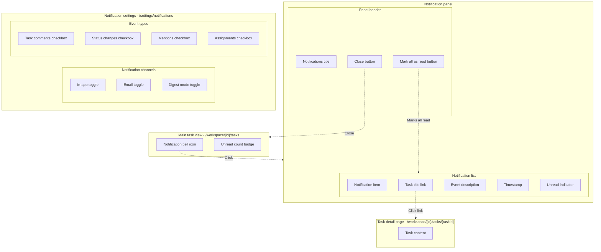
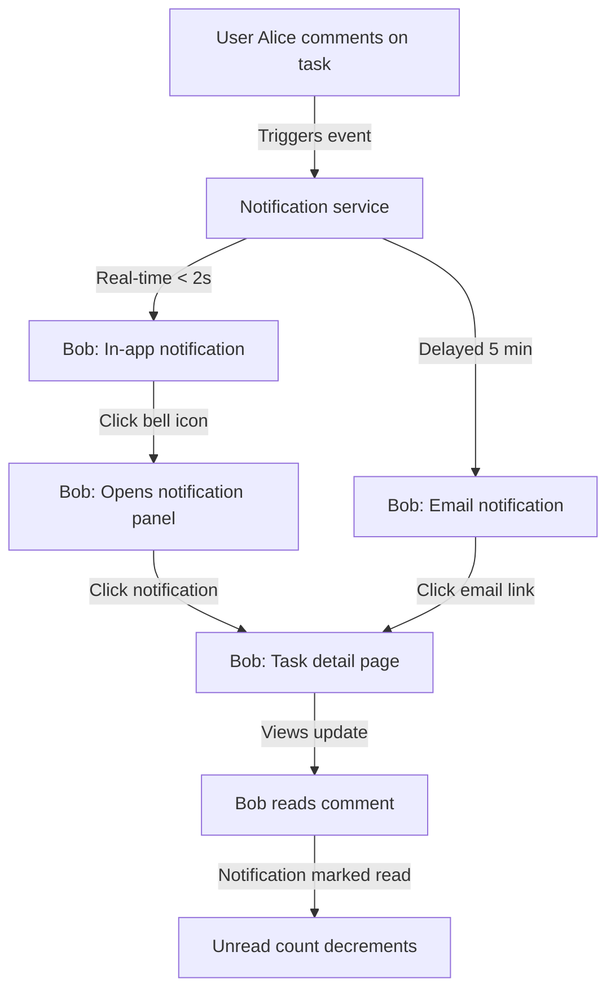

<guidelines>

## Document writing style

**Documents must follow:**

- Optimize for conciseness, brevity, scannability
- Use lists, sentence fragments, broken grammar OK
- Remove unnecessary articles, verbose phrasing
- Direct, terse language

## User actions

**Common requests:**
- "Write a PRD for [feature]" → [Draft or write a PRD](#draft-or-write-a-prd)
- "Draft a TDD for [feature]" → [Write a TDD](#write-a-tdd)
- "Plan a code change" → [Write a TDD](#write-a-tdd)
- "Research [topic/technology/approach]" → [Research a topic](#research-a-topic)

### Draft or write a PRD

Steps:

0. Acknowledge: **Now writing a PRD.**
1. **Research:** Understand existing systems/constraints. Write to `artefacts/discovery-<title>.md` if non-obvious findings.
2. **Check context:** Read `artefacts/discovery-<title>.md` if exists.
3. **Clarify:** Ask ambiguities before drafting. See *Open questions guidelines*.
4. **Draft:** Follow PRD structure below.
5. **Add questions:** Unresolved items → PRD's "Open questions".
6. **Save:** Write to `artefacts/prd-{slug}.md`.

### Write a TDD

Steps:

0. Acknowledge: **Now writing a TDD.**
1. **Research:** Find code patterns, data models, integration points. Write to `artefacts/discovery-<title>.md` if non-obvious findings.
2. **Check context:** Read `artefacts/prd-{slug}.md` and `artefacts/discovery-<title>.md`.
3. **Clarify:** Ask technical ambiguities with recommended solutions.
4. **Draft:** Follow TDD structure below.
5. **Add questions:** Unresolved implementation items → TDD's "Open questions".
6. **Save:** Write to `artefacts/tdd-<feature>.md`.

### Research a topic

Write findings to Discovery Document (`artefacts/discovery-<title>.md`).

## Planning artefacts

### Document structure

Planning artefacts in `artefacts/` (local, git-ignored):

- `discovery-<title>.md` - environmental context/constraints
- `prd-{slug}.md` - product requirements
- `tdd-<feature>.md` - implementation plans

Notes persist in `notes/` across branches. Users may specify custom locations.

**Guidelines:**

- Write to `artefacts/` (eg, `artefacts/prd-{slug}.md`)
- Scope decisions:
  - Large projects: discovery, PRD, TDD
  - Small tasks: TDD only
- Confirm with user before PRD → TDD

### Multiple planning tracks

When user requests work outside current scope:

- New feature/scope → new TDD (`tdd-another-feature.md`)
- New research → new discovery (`discovery-api-quirks.md`)

## Discovery document guidelines

**Purpose:** Capture environmental constraints/context for planning. NOT implementation details or obvious info.

Answers: "What's needed about the environment for good planning decisions?"
Not: "How will I implement this?" (that's TDD)

**Typical inclusions:**

- Current system architecture/patterns
- Existing code structures to follow
- Technical constraints/limitations
- Database schemas/data formats
- Third-party APIs and quirks
- Non-obvious edge cases with business impact
- Library research (capabilities, usage, tradeoffs)

**Typical exclusions:**

- Implementation pseudocode/code samples (→ TDD)
- Obvious edge cases (eg, "React handles HTML escaping")
- Migration strategies/rollback plans (→ TDD)
- Backwards compatibility solutions (→ TDD)
- "Next steps" or implementation order (→ TDD)
- Test cases/testing strategy (→ TDD)
- Effort estimates/timelines (→ PRD roadmap)

### Condensed summary

Include "condensed summary" H2 at beginning of discovery docs.

Write condensed prompt to guide future LLM agents to research codebase independently and reach same conclusions. Aim for minimum tokens.

Prefer citations to code over examples/long explanations. Goal: empower agents to find info independently.

Consider including:

- Context (required) - short summary of ask
- Function/symbol names (with code locations)
- Glossary
- Issues found
- Key insights

### Discovery vs TDD

Test: "Would this info still be true if we chose completely different implementation?"

- YES → Discovery (eg, "Database uses SQLite", "Tailwind v4 has no config file")
- NO → TDD (eg, "Use buildPrompt() function", "Handle errors with try/catch")

### Patterns to avoid

- Don't document obvious behaviors ("React handles HTML escaping", "UTF-8 works in database")
- Don't include implementation details ("Use try/catch for errors")

## PRD guidelines

Typical sections (include if applicable):

- **Initial ask** (required) — Restatement of original request. Update with clarifications.
- **Problem statement** — Current pain points/issues feature addresses.
- **Solution overview** — High-level summary (numbered list of key capabilities).
- **Functional requirements** — Detailed feature requirements (F1, F1.1, F1.2). Compact bullet format with em-dashes.
- **Non-functional requirements** — Performance, accessibility, scalability (NF1, NF2...). Compact bullets.
- **Technical constraints** — Tech stack, integration, implementation constraints (TC1, TC2...). Compact bullets.
- **Design considerations** — Important design decisions/implementation notes (DC1, DC2...). Compact bullets.
- **Screen interactions** — Mermaid diagram: UI structure, components, navigation flows. Include "Key entities" subsection (pages/URLs, UI components, API endpoints).
- **User flow** — Mermaid diagram: end-to-end user journey through feature.
- **Open questions** — Clarifying questions with recommended solutions/alternatives.
- **Out of scope** — Features deferred for future.
- **Additional context** — Environmental info, existing systems, research findings.

**Good PRD qualities:**

- Technical solution plan can be made from it
- Edge cases/error scenarios addressed
- Engineers can estimate without many questions

### Functional requirements

Concise bullet format:

- Give IDs to requirements (F1, F1.1, F1.2)
- Use em-dashes (—) to separate name from description
- Brief, action-oriented descriptions
- Group related requirements under descriptive headings
- Add context after bullet list if needed

See "PRD example".

**Formatting guidelines:**

- Omit user stories unless essential context
- Avoid wordy phrases ("Users must be able to", "System must support")
- Active, direct language
- Include timing/constraints inline
- Keep additional context separate from main list

**Apply same format to:**

- Non-functional requirements (NF1, NF2...)
- Technical constraints (TC1, TC2...)
- Any other requirement lists

### Design considerations

Document important design decisions that don't fit into functional requirements. See example.

### Screen interactions diagram

For PRDs with UI components, include screen interactions diagram showing navigation/UI interactions.

**Purpose:** Visualize UI structure, component hierarchy, interactive flows for frontend implementation scope.

**When to include:**

- Multiple screens/views
- Complex user interactions
- Features requiring UI component design

**Structure rules:**

1. **Top-level subgraphs:** Screens/pages/views with URL paths in label
2. **Nested subgraphs:** Group related UI elements ("Panel header", "Form actions", "Navigation bar")
3. **Nodes:** Individual UI elements (buttons, links, inputs, indicators)
4. **Dashed arrows (`-.->`)**: User interactions/navigation between screens/elements
5. **Arrow labels:** Describe action ("Click", "Opens", "Navigates to", "Closes")

**What to include:**

- Screens and URLs
- Interactive elements (buttons, links, dropdowns, toggles)
- Component groupings (headers, forms, navigation)
- Navigation flows between screens
- Modal/drawer/panel open/close interactions

**What to exclude:**

- Non-interactive elements (static text, images, decorations)
- Internal component hierarchy (keep flat within subgraphs)
- Detailed styling info
- Data flow (this is for UI interaction, not data)

**Best practices:**

- Use quoted labels: `["Element name"]`
- Descriptive subgraph identifiers: `subgraph MainView["Main view"]`
- Keep nesting to 2-3 levels max
- Focus on user-facing interactions, not technical implementation
- Consistent naming for similar interaction types
- Group related elements in nested subgraphs

**After diagram, include "Key entities" subsection:**

List relevant pages/URLs, UI components, API endpoints related to screen interactions.

### User flow diagram

For PRDs with multi-step processes or cross-user interactions, include user flow diagram showing end-to-end journey.

**Purpose:** Illustrate sequential flow of actions, system responses, state changes from user perspective. Shows user actions + system behavior.

**When to include:**

- Multi-step processes
- Multiple users/roles
- Asynchronous operations (notifications, background jobs)
- Complex conditional logic/branching paths

**Structure rules:**

1. **Nodes:** States, actions, events in user journey
2. **Solid arrows (`-->`)**: Sequential flow/causality
3. **Arrow labels:** Describe trigger/condition/action
4. **System nodes:** Include backend/system processes when relevant to flow

**What to include:**

- User actions (clicks, inputs, navigation)
- System responses (notifications, data updates, state changes)
- Different user perspectives when feature involves collaboration
- Conditional branches for important decision points

**What to exclude:**

- Implementation details (API endpoints, function names)
- Error handling flows (unless critical to understanding)
- UI component specifics (→ Screen interactions)
- Technical architecture (→ TDD)

**Best practices:**

- Keep nodes concise (5-8 words max)
- Highlight async operations/parallel flows
- Consistent verb tenses (present tense for actions)

### PRD example

````markdown
# PRD: Task notification system

## Initial ask

Add notification system for task updates (real-time + email).

## Problem statement

Users have no notification of task updates. Must manually check task list, leading to:

- Missed important updates
- Delayed responses to status changes
- No awareness of comments/mentions
- Difficulty staying synchronized with team

## Functional requirements

### F1: Notification events

Users receive notifications for:

- **F1.1. Task comments** — Someone comments on watched task
- **F1.2. Status changes** — Task status changes
- **F1.3. Mentions** — Mentioned in comments/descriptions
- **F1.4. Task assignments** — Task assigned to them

Each notification: event type, task title (linked), who triggered it, change info, timestamp.

### F2: Notification delivery

Notification delivery channels:

- **F2.1. Real-time notifications** — In-app within 2 seconds of event
- **F2.2. Email notifications** — Email within 5 minutes of event
- **F2.3. Notification center** — View all in dedicated panel
- **F2.4. Unread indicator** — Show unread count on notification bell icon

## Non-functional requirements

- **NC1.1. Performance** — Real-time notifications delivered within 2 seconds

## Technical constraints

- **TC1. Database** — Use existing PostgreSQL database with Prisma ORM
- **TC2. Authentication** — Integrate with current NextAuth session management

## Design considerations

- **DC1. No backward compatibility** — New implementation replaces legacy system entirely
- **DC2. Separate personal and business contacts** — Keep distinct data models for each type

## Screen interactions



### Key entities

**Pages and URLs:**

- `/workspace/[id]/tasks` - Main tasks view w/ notification bell
- `/workspace/[id]/tasks/[taskId]` - Task detail
- `/settings/notifications` - Notification preferences

**UI components:**

- Notification bell icon (top nav)
- Notification panel (slide-out drawer)
- Notification item (list item)
- Unread badge (count indicator)

**API endpoints:**

- `GET /api/notifications`
- `PATCH /api/notifications/[id]/read`
- `PATCH /api/notifications/mark-all-read`
- `GET /api/user/notification-preferences`
- `PATCH /api/user/notification-preferences`

## User flow



## Out of scope

Deferred for future:

- Slack/Discord integration
- Mobile push notifications
- Browser push notifications (desktop)
- Notification analytics/reporting

## Open questions

1. **Root page:** Should root `/` redirect to default language (eg, `/es`), or remain separate?

   - a. Redirect to `/es` based on browser language detection _(recommended)_
   - b. Show language selection landing page

2. **Default role:** What should be default user role upon registration?

   - a. Basic user with limited permissions _(recommended)_
   - b. Trial user with time-limited premium features
````

## TDD guidelines

### TDD structure

Use single `tdd-<feature>.md` file for all projects.

Include if applicable:

- **Call graph:** (if applicable) See "### Call graph" below
- **Pseudocode breakdown:** (if applicable) See "### Pseudocode breakdown" below
- **Data models:** (if any) Types, interfaces, schemas, data structures
- **Files:** (if applicable) New, modified, removed files. Include reference/context files for LLM agents to understand existing patterns
- **CSS classes:** (if any) Styling/layout classes needed. List class names only - no definitions, no Tailwind utilities, no CSS code.
- **Testing strategy:** (if applicable, if user asked) see "### Testing strategy" below
- **Open questions:** (if applicable) Clarifying questions for ambiguous implementation details. See "Open questions guidelines"

Keep concise:

- Omit sections that don't add value
- List items rather than define when appropriate (eg, CSS classes)

### Call graph

Visualizes how functions, modules, systems interconnect. Use to explain complex multi-component implementations.

**When to include:**

- Multiple inter-connected functions across files
- Complex module dependencies
- System integration points
- Architectural changes affecting multiple components

**Structure rules:**

1. **Subgraphs:** Group related components by file/module
2. **Nodes:** Individual functions/components/modules
3. **Reference letters:** Add `[A]`, `[B]`, etc. to correlate with pseudocode
4. **Status markers:** Highlight changes with color-coded classes:
   - Green (`.new`): New components
   - Yellow (`.updated`): Modified components
   - Red (`.removed`): Removed components
5. **Arrows:** Show relationships (uses, calls, renders, configured with)
6. **Quote all labels:** Use `["label"]` syntax to avoid special character issues

**What to include:**

- New, modified, removed functions/components
- References to what uses new/updated components (search repo if needed)
- Key integration points between components
- Data flow direction when relevant

**What to exclude:**

- Internal implementation details (→ pseudocode)
- Trivial helper functions unless central to understanding
- Standard library/framework functions
- Tests

**Best practices:**

- Focus graph on changed components + immediate dependencies
- Descriptive arrow labels ("uses", "calls", "renders via", "configured with")
- Search codebase to find what uses new/updated components, not just current changes. Trace to entry points if possible (eg, API calls, CLI actions) - search repo as needed
- Correlate graph nodes to pseudocode sections using reference letters

### Pseudocode breakdown

Break down core logic into pseudocode showing flow/key components. See [Example TDD](#example-tdd) for format.

- Add reference letters `[A]`, `[B]` to find connections easily
- Mark `[🟢 NEW]` or `[🟡 UPDATED]` or `[🔴 REMOVED]` where necessary
- Use "sh" for syntax highlighting, even if not shell syntax
- If function/file not updated/removed, leave it out
- Include descriptive comments: logic flow, business rules
- Keep JSX/markup minimal: high-level component references, not full JSX trees
- Focus on logic flow, not rendering details
- Use `→ render <Component>` rather than showing JSX structure

**Example: Avoid verbose JSX**

```sh
# AVOID: Too verbose
renderNotificationPanel()
  → notifications = getUnreadNotifications()
  → return (
      <div className="fixed right-0 w-96 shadow-lg">
        <div className="border-b p-4">
          <h2>Notifications</h2>
            ... [skip]

# PREFER: Concise, logic-focused
renderNotificationPanel()
  → notifications = getUnreadNotifications()
  → render <NotificationPanel notifications={notifications}>
      <h2>Notifications</h2>
      {/* for each notification: */}
        <Notification ...>
    </>
```

### Testing strategy

List unit, integration, other tests needed. Include test commands to run individual test files. See [Example TDD](#example-tdd) for format.

- List test data/fixtures to be used. Allows reviewers to gauge test file complexity
- List dependencies needing mocks and why (external APIs, databases, time-dependent functions)
- Be EXTREMELY conservative: plan minimum tests (eg, single smoke test)
- Include exact command to run relevant tests

### Example TDD

````markdown
# TDD: Task completion tracker

## Initial ask

Add task completion feature: mark done w/ timestamp.

## Data models

```typescript
interface Task {
  id: string;
  title: string;
  status: "pending" | "completed";
  completedAt: Date | null;
}
```

## Pseudocode breakdown

**completeTask:** mark task complete

```sh
# == tasks/complete.ts ==

completeTask(taskId) # [🟢 NEW]
  # Validate task exists
  → task = prisma.task.findUnique({ where: { id: taskId } })
  if !task:
    → log "Task not found"
    → return { ok: false, error: "NOT_FOUND" }

  # Check if already completed
  if task.status == 'completed':
    → log "Already completed"
    → return { ok: true, task }

  # Mark complete and persist
  → prisma.task.update({
      where: { id: taskId },
      data: { status: 'completed', completedAt: new Date() }
    })
  → return { ok: true, task }
```

## Files

**New files:**

- `src/tasks/complete.ts`

**Modified files:**

- `prisma/schema.prisma` - Add Task model

## Files

**New files:**

- `src/tasks/complete.ts`

**Modified files:**

- `prisma/schema.prisma` - Add Task model

## CSS classes

- `.task-item`
- `.task-checkbox`
- `.task-completed`

## Testing strategy

### Running tests

- `npx vitest src/tasks/complete.test.ts`

### complete.test.ts

```typescript
// Mocks
vi.mock("@/lib/prisma");

// Test data
const PENDING_TASK = { id: "1", title: "Test", status: "pending", completedAt: null };
const COMPLETED_TASK = { id: "2", title: "Done", status: "completed", completedAt: new Date() };

describe("completeTask", () => {
  test("marks task complete w/ timestamp");
  test("returns error if task not found");
  test("idempotent if already completed");
});
```

## Open questions

1. **Undo completion:** Should users be able to mark a completed task as incomplete again?

   a. Allow unmarking with completedAt set to null _(recommended)_
   b. No undo - completion is final

2. **UI feedback:** What should happen after clicking the complete button?

   a. Show success toast notification _(recommended)_
   b. Silently update with visual state change only
````

## Open questions guidelines

Ask clarifying questions for ambiguity/missing requirements.

If points for clarification will significantly change plan depending on answer, ask *before* creating plans.

**In chat conversation:**

For each question:
- Clear recommended solution with reasoning
- Alternative approaches when applicable
- Relevant considerations (technical, business, UX)

**In the document:**

Add questions to document's "Open questions" section using minimal format:
- Question title only
- Lettered options (a, b, c)
- Mark recommended with _(recommended)_
- No explanations or reasoning

**When user answers:** Update **Initial ask** section with clarification. Keeps it as single source of truth for refined requirements.

</guidelines>
