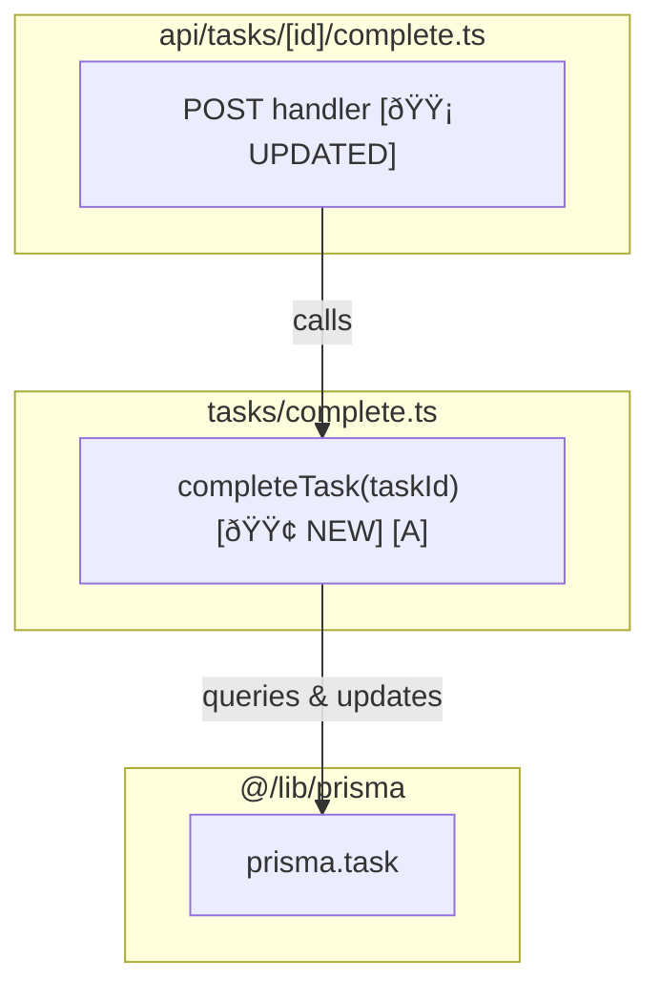

# Planning with PRD and TDD

This skill guides structured planning before implementation using two document types:

- **PRD** (`prd-{slug}.md`) — Product requirements, functional specs, what system should do
- **TDD** (`tdd-<feature>.md`) — Technical design, implementation plan, how to build it

**Core workflow:** Research → Clarify ambiguities → Draft plan → Save to `artefacts/`

Document choice depends on task complexity: trivial changes need no planning; small tasks need TDD only; complex features benefit from full PRD + TDD workflow.

## Formatting standards

**All documents:**

- High-density language: lists, fragments, no unnecessary articles
- Scannability: short sections, bullet points, clear headings
- IDs: F1, F1.1 for functional requirements; TR1, NF1, TC1, DC1 for other lists
- Em-dashes: **Name** — Description (for all requirement lists)
- Active voice: "System validates" not "System must validate"
- Inline constraints: timing/limits directly in descriptions

**Code blocks:**

- Max 7 lines - show structure only, not full implementation
- Use "sh" syntax for pseudocode
- Minimal JSX: `→ render <Component>` over full markup
- Reference letters `[A]`, `[B]` to correlate with diagrams
- Status markers: `[🟢 NEW]` `[🟡 UPDATED]` `[🔴 REMOVED]`

**Mermaid diagrams:**

- Quote all labels: `["Button"]`
- Descriptive subgraphs: `subgraph MainView["Main view"]`
- Screen interactions: dashed arrows (`-.->`) for user actions
- User flow: solid arrows (`-->`) for sequential flow
- Keep nodes concise (5-8 words max)

## User actions

**Common requests:**
- "Write a PRD for [feature]" → [Draft or write a PRD](#draft-or-write-a-prd)
- "Draft a TDD for [feature]" → [Write a TDD](#write-a-tdd)
- "Plan a code change" → [Write a TDD](#write-a-tdd)
- "Research [topic/technology/approach]" → [Research a topic](#research-a-topic)
- "create combined tdd-prd for [feature]" → [Combined PRD-TDD](#combined-prd-tdd)

### Draft or write a PRD

Steps:

1. **Research:** Understand existing systems/constraints.
2. **Clarify:** Ask ambiguities before drafting. See *Open questions guidelines*.
3. **Draft:** Follow PRD structure below.
4. **Add questions:** Unresolved items → PRD's "Open questions".
5. **Save:** Write to `artefacts/prd-{slug}.md`.

### Write a TDD

Steps:

1. **Research:** Find code patterns, data models, integration points.
2. **Check context:** Read `artefacts/prd-{slug}.md`.
3. **Clarify:** Ask technical ambiguities with recommended solutions.
4. **Draft:** Follow TDD structure below.
5. **Add questions:** Unresolved implementation items → TDD's "Open questions".
6. **Save:** Write to `artefacts/tdd-<feature>.md`.

### Combined PRD-TDD

For small to medium features where both product requirements and technical implementation can be covered together:

Steps:

1. **Research:** Find existing patterns, constraints.
2. **Clarify:** Ask ambiguities before drafting.
3. **Draft:** Combine PRD and TDD sections in single document. Use PRD structure for requirements, TDD structure for implementation. Skip duplicate sections (Initial ask, Open questions).
4. **Save:** Write to `artefacts/plan-<feature>.md`.

## Planning artefacts

### Document structure

Planning artefacts in `artefacts/` (local, git-ignored):

- `prd-{slug}.md` - product requirements
- `tdd-<feature>.md` - implementation plans

For research-heavy tasks with complex constraints, see `discovery.md` for discovery document guidelines.

Notes persist in `notes/` across branches. Users may specify custom locations.

**Guidelines:**

- Write to `artefacts/` (eg, `artefacts/prd-{slug}.md`)
- Scope decisions:
  - Large projects: PRD, TDD
  - Small tasks: TDD only
- Confirm with user before PRD → TDD

### Multiple planning tracks

When user requests work outside current scope:

- New feature/scope → new TDD (`tdd-another-feature.md`)

## Open questions guidelines

Ask clarifying questions for ambiguity/missing requirements.

If points for clarification will significantly change plan depending on answer, ask *before* creating plans.

**In chat conversation:**

For each question:
- Clear recommended solution with reasoning
- Alternative approaches when applicable
- Relevant considerations (technical, business, UX)

**In the document:**

Add questions to document's "Open questions" section using minimal format:
- Question title only
- Lettered options (a, b, c)
- Mark recommended with _(recommended)_
- No explanations or reasoning

**When user answers:** Update **Initial ask** section with clarification. Keeps it as single source of truth for refined requirements.

## PRD guidelines

Typical sections (include if applicable):

- **Initial ask** (required) — Restatement of original request. Update with clarifications.
- **Problem statement** — Current pain points/issues feature addresses.
- **Solution overview** — High-level summary (numbered list of key capabilities).
- **Functional requirements** — Product-focused specification of user-observable behavior (F1, F1.1, F1.2). Compact bullet format with em-dashes. See "Functional requirements" section.
- **Technical requirements** — System-level technical contracts, integration points, API specifications (TR1, TR2...). Compact bullets with em-dashes. See "Technical requirements" section.
- **Non-functional requirements** — Performance, accessibility, scalability (NF1, NF2...). Compact bullets.
- **Technical constraints** — Technology limitations, tech stack constraints, platform requirements (TC1, TC2...). Compact bullets. See "Technical constraints" section.
- **Quality gates** — Commands that must pass for every piece of work (typecheck, lint, tests, etc). See "Quality gates" section.
- **Design considerations** — Important design decisions/implementation notes (DC1, DC2...). Compact bullets.
- **Screen interactions** — Mermaid diagram: UI structure, components, navigation flows. Include "Key entities" subsection (pages/URLs, UI components, API endpoints).
- **User flow** — Mermaid diagram: end-to-end user journey through feature.
- **Open questions** — Clarifying questions with recommended solutions/alternatives.
- **Out of scope** — Features deferred for future.
- **Additional context** — Environmental info, existing systems, research findings.

**Good PRD qualities:**

- Technical solution plan can be made from it
- Edge cases/error scenarios addressed
- Engineers can estimate without many questions

### Functional requirements

Product-focused specification of user-observable behavior. Describe **what** users can do and what system does, not **how** it's implemented. See [Formatting standards](#formatting-standards) for format rules.

**Good (product-focused):**
- **F1.1. Contact sync** — Changes to contacts sync to mirror workspace within 2 seconds
- **F1.2. Status tracking** — System tracks when contacts were last viewed by user
- **F1.3. Task notifications** — User receives notification when someone comments on watched task

**Bad (implementation details):**
- **F1.1** `updateContact()` calls mirror function with `touchUpdatedAt: true`
- **F1.2** Uses Redis cache with 5-minute TTL
- **F1.3** WebSocket connection emits 'notification' event

**Test:** If it mentions function names, parameters, cache layers, or data structures → move to "Technical requirements" or TDD.

**Example structure:**

### F1: Notification events

- **F1.1. Task comments** — User receives notification when someone comments on watched task
- **F1.2. Status changes** — User receives notification when task status changes
- **F1.3. Mentions** — User receives notification when mentioned in comments/descriptions

Each notification includes: event type, task title (linked), who triggered it, timestamp.

### Technical requirements

System-level technical contracts, integration points, API specifications. Describes technical **what** (contracts, interfaces, data flows) without implementation **how** (error handling, function design). See [Formatting standards](#formatting-standards) for format rules.

**Include:** API contracts, integration behaviors, WebSocket events, database triggers, third-party service calls, data sync specifications

**Exclude:** Implementation approach (→ TDD), error handling strategies (→ TDD), function internal logic (→ TDD)

**Example structure:**

### TR1: Contact sync integration

- **TR1.1. Update API** — `updateContact()` accepts `touchUpdatedAt: boolean` parameter to control timestamp updates
- **TR1.2. Status tracking** — `updateContactViewedStatus()` triggers mirror workspace sync via mirror function
- **TR1.3. Tag operations** — `setTagsForContact()` and `deleteWorkspaceContactTag()` call mirror functions

### TR2: Real-time notification delivery

- **TR2.1. WebSocket events** — Server emits `notification` event with payload: `{userId, eventType, taskId, timestamp}`
- **TR2.2. Email queue contract** — Accepts notification events via `queue.add('email', payload)` with same schema

**Functional vs Technical requirements:**
- **Functional** → User-observable behavior, product features, UI interactions ("User receives notification when...")
- **Technical** → System contracts, API specifications, integration points, data flows ("`updateContact()` accepts `touchUpdatedAt` parameter...")
- **TDD** → Implementation approach, function design, error handling strategies ("Use try/catch for database errors...")

### Technical constraints

Technology limitations and platform requirements that constrain implementation choices. Describes what technologies **must** or **cannot** be used. See [Formatting standards](#formatting-standards) for format rules.

**Include:** Tech stack requirements, platform limitations, browser support, library versions, infrastructure constraints, performance budgets

**Exclude:** System integration contracts (→ Technical requirements), implementation approach (→ TDD)

**Example structure:**

### Technical constraints

- **TC1. Tech stack** — Must use existing Prisma ORM, cannot add new database
- **TC2. Browser support** — Must support Safari 15+, Chrome 90+
- **TC3. Performance budget** — Initial bundle size cannot exceed 200KB
- **TC4. Infrastructure** — Must deploy on existing Node.js 18 servers

### Quality gates

Commands that must pass for every piece of work. Example format:

```markdown
## Quality gates

- `pnpm typecheck` - Type checking
- `pnpm lint` - Linting
- `pnpm test` - Unit tests

For UI work: Verify in browser using devtools
```

### Design considerations

Document important design decisions that don't fit into functional requirements. See example.

### Screen interactions diagram

Visualize UI structure, component hierarchy, interactive flows. Include when feature has multiple screens/views or complex user interactions.

**Structure:**

1. Top-level subgraphs: Screens/pages with URL paths
2. Nested subgraphs: Group related UI elements
3. Nodes: Individual UI elements (buttons, links, inputs)
4. Dashed arrows (`-.->`) with labels for user actions
5. Include "Key entities" subsection listing pages/URLs, UI components, API endpoints

**Include:** Screens/URLs, interactive elements, navigation flows, modal/drawer interactions  
**Exclude:** Non-interactive elements, internal component hierarchy, styling, data flow

See [Formatting standards](#formatting-standards) for diagram rules.

### User flow diagram

Show end-to-end user journey for multi-step processes or cross-user interactions.

**Structure:**

1. Nodes: States, actions, events in user journey
2. Solid arrows (`-->`) with trigger/condition labels
3. Include system responses when relevant to flow

**Include:** User actions, system responses, conditional branches  
**Exclude:** Implementation details, error handling (unless critical), UI component specifics

See [Formatting standards](#formatting-standards) for diagram rules.

### PRD example

Shows structure - see guidelines above for section details.

````markdown
# PRD: Task notification system

## Initial ask
Add notification system for task updates (real-time + email).

## Problem statement
Users miss updates by manually checking task list.

## Functional requirements

### F1: Notification events
- **F1.1. Task comments** — User receives notification when someone comments on watched task
- **F1.2. Status changes** — User receives notification when task status changes
- **F1.3. Mentions** — User receives notification when mentioned in comments/descriptions

Each notification: event type, task title (linked), who triggered it, timestamp.

### F2: Notification delivery
- **F2.1. Real-time** — Notifications appear in-app within 2 seconds of event
- **F2.2. Email** — Email notifications sent within 5 minutes for unwatched in-app notifications
- **F2.3. Notification center** — User can view all notifications in dedicated panel

## Technical requirements

### TR1: Real-time delivery
- **TR1.1. WebSocket events** — Server emits `notification` event: `{userId, eventType, taskId, timestamp, triggeredBy}`
- **TR1.2. Connection handling** — Client reconnects automatically on disconnect, fetches missed notifications

### TR2: Email queue
- **TR2.1. Queue contract** — Accepts events via `emailQueue.add('notification', payload)` with notification schema
- **TR2.2. Batch processing** — Groups notifications by user, sends max 1 email per 5 minutes per user

## Non-functional requirements
- **NF1. Performance** — Real-time notifications delivered within 2 seconds
- **NF2. Scalability** — Email queue handles 1000+ notifications/min

## Technical constraints
- **TC1. WebSocket library** — Must use existing Socket.io v4 installation
- **TC2. Email service** — Must use existing SendGrid integration

## Quality gates
- `pnpm typecheck`, `pnpm lint`, `pnpm test`

For UI work: Verify in browser via http://localhost:3000/notifications

## Screen interactions
[Mermaid diagram: bell icon → notification panel → task detail]

### Key entities
**Pages:** `/workspace/[id]/tasks`, `/settings/notifications`  
**Components:** Notification bell, panel, item  
**API:** `GET /api/notifications`, `PATCH /api/notifications/[id]/read`

## Open questions
1. **Root page:** Redirect to `/es` or show language selection?
   - a. Redirect based on browser detection _(recommended)_
   - b. Show selection page
````

## TDD guidelines

### TDD structure

Use single `tdd-<feature>.md` file. Include if applicable: Call graph, Pseudocode, Data models, Files, CSS classes, Testing strategy, Open questions.

**Keep concise:**
- Omit sections without value
- Limit to 700 words (unless specified)
- Max 7 lines per code block - show structure only

See [Example TDD](#example-tdd) below for complete demonstration.

### Call graph

Visualizes how functions, modules, systems interconnect.

**When to include:** Multiple interconnected functions, complex dependencies, system integration points, architectural changes

**Structure:** Subgraphs (by file/module), nodes (functions/components), reference letters [A][B], status markers (🟢🟡🔴), arrows with descriptive labels ("uses", "calls", "renders via")

**Include:** Changed functions/components, what uses them, integration points, data flow direction  
**Exclude:** Internal implementation details, trivial helpers, standard library/framework functions, tests

**Best practices:** Focus on changed components + immediate dependencies, search codebase for usage, trace to entry points (API calls, CLI actions), correlate nodes to pseudocode using reference letters

**Example:**



Key elements shown:
- **Subgraphs** for each file/module
- **Reference letters** `[A]` to correlate with pseudocode
- **Status markers** `[🟢 NEW]` `[🟡 UPDATED]`
- **Descriptive arrows** showing relationships
- **Entry points** (API route) and **integration points** (Prisma)

### Pseudocode breakdown

Show logic flow with reference letters [A][B]. Mark status: 🟢 NEW, 🟡 UPDATED, 🔴 REMOVED. Use "sh" syntax. Keep JSX minimal.

**Key guidelines:** Include descriptive comments (logic flow, business rules), use `→ render <Component>` not full JSX trees, focus on logic not rendering details

### Testing strategy

List tests needed with run commands.

**Include:** Test data/fixtures used, dependencies needing mocks + why (external APIs, databases, time-dependent), exact command to run tests

**Format:** 1 line per test (name only). Add 1-line comment after if key info needed.

### Example TDD

````markdown
# TDD: Task completion tracker

## Initial ask

Add task completion feature: mark done w/ timestamp.

## Data models

```typescript
interface Task {
  id: string;
  title: string;
  status: "pending" | "completed";
  completedAt: Date | null;
}
```

## Pseudocode breakdown

**completeTask:** mark task complete

```sh
# == tasks/complete.ts ==

completeTask(taskId) # [🟢 NEW]
  # Validate task exists
  → task = prisma.task.findUnique({ where: { id: taskId } })
  if !task: return { ok: false, error: "NOT_FOUND" }
  if task.status == 'completed': return { ok: true, task }
  
  # Mark complete and persist
  → prisma.task.update({ ... })
  → return { ok: true, task }
```

## Files

**New:** `src/tasks/complete.ts`  
**Modified:** `prisma/schema.prisma` - Add Task model

## CSS classes

- `.task-item`, `.task-checkbox`, `.task-completed`

## Testing strategy

**Run:** `npx vitest src/tasks/complete.test.ts`

**Mocks:** `@/lib/prisma`  
**Fixtures:** `PENDING_TASK`, `COMPLETED_TASK`

**Tests:**
- marks task complete w/ timestamp
- returns error if task not found
- idempotent if already completed

## Open questions

1. **Undo completion:** Should users be able to mark completed task as incomplete?
   - a. Allow unmarking with completedAt set to null _(recommended)_
   - b. No undo - completion is final
````

## Quick reference

### Document decision tree


### Key reminders

**Before drafting:**
- Research existing patterns, constraints, architecture
- Ask clarifying questions if ambiguity will significantly change plan
- Check for existing PRD documents

**During drafting:**
- Use high-density language: lists, fragments, no fluff
- Add IDs to requirements: F1, F1.1, NF1, TC1
- Include reference letters `[A]` in call graphs to correlate with pseudocode
- Mark status: `[🟢 NEW]` `[🟡 UPDATED]` `[🔴 REMOVED]`

**Document boundaries:**
- **PRD:** What system should do (functional + technical requirements), not how (implementation)
- **TDD:** How to implement, code structure, testing approach
