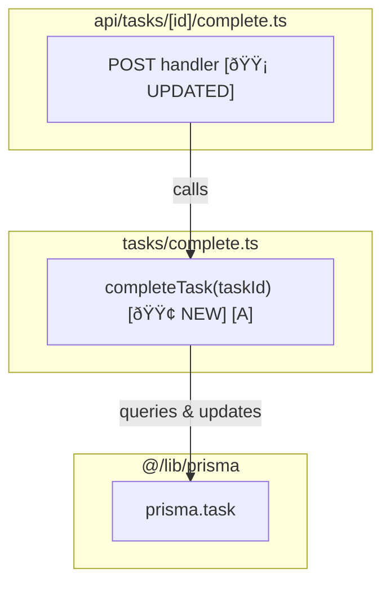

# Planning with PRD and TDD

This skill guides structured planning before implementation. Plans combine product requirements (PRD) and technical design (TDD) sections in a single document, including only the sections relevant to the task.

**Core workflow:** Detect intent → Research → Clarify ambiguities → Draft plan → Save to `artefacts/plan-<title>.md`

## Formatting standards

**All documents:**

- High-density language: lists, fragments, no unnecessary articles
- Scannability: short sections, bullet points, clear headings
- IDs: F1, F1.1 for functional requirements; TR1, NF1, TC1, DC1 for other lists
- Em-dashes: **Name** — Description (for all requirement lists)
- Active voice: "System validates" not "System must validate"
- Inline constraints: timing/limits directly in descriptions

**Code blocks:**

- Max 7 lines - show structure only, not full implementation
- Use "sh" syntax for pseudocode
- Minimal JSX: `→ render <Component>` over full markup
- Reference letters `[A]`, `[B]` to correlate with diagrams
- Status markers: `[🟢 NEW]` `[🟡 UPDATED]` `[🔴 REMOVED]`

**Mermaid diagrams:**

- Quote all labels: `["Button"]`
- Descriptive subgraphs: `subgraph MainView["Main view"]`
- Screen interactions: dashed arrows (`-.->`) for user actions
- User flow: solid arrows (`-->`) for sequential flow
- Keep nodes concise (5-8 words max)

## User actions

**Common requests:**
- "Plan [feature]" → [Write a plan](#write-a-plan) (includes all sections — default)
- "Write a PRD for [feature]" → Write a plan with PRD sections only
- "Draft a TDD for [feature]" →  Write a plan with TDD sections only

**Mode detection:** "PRD" in request = PRD sections only; "TDD" in request = TDD sections only; otherwise include all applicable sections.

### Write a plan

Steps:

1. **Detect mode:** Determine which sections to include from user request. See [Mode detection](#mode-detection).
2. **Research:** Find existing patterns, constraints, architecture. For TDD/combined mode, find code patterns, data models, integration points.
3. **Clarify:** Ask ambiguities before drafting. See *Open questions guidelines*.
4. **Draft:** Follow section structure below, including only sections for the detected mode.
5. **Add questions:** Unresolved items → document's "Open questions" section.
6. **Save:** Write to `artefacts/plan-<title>.md`.

## Planning artefacts

### Document structure

Planning artefacts in `artefacts/` (local, git-ignored):

- `plan-<title>.md` — combined plan (PRD sections, TDD sections, or both)

Notes persist in `notes/` across branches. Users may specify custom locations.

**Guidelines:**

- Write to `artefacts/` (eg, `artefacts/plan-<title>.md`)
- Scope decisions:
  - Large projects: Combined (PRD + TDD sections)
  - Small tasks: TDD sections only
- All plans use `# Plan: <Title>` heading

### Multiple planning tracks

When user requests work outside current scope:

- New feature/scope → new plan (`plan-another-feature.md`)

## Open questions guidelines

Ask clarifying questions for ambiguity/missing requirements.

If points for clarification will significantly change plan depending on answer, ask *before* creating plans.

**In chat conversation:**

For each question:
- Clear recommended solution with reasoning
- Alternative approaches when applicable
- Relevant considerations (technical, business, UX)

**In the document:**

Add questions to document's "Open questions" section using minimal format:
- Question title only
- Lettered options (a, b, c)
- Mark recommended with _(recommended)_
- No explanations or reasoning

**When user answers:** Update **Initial ask** section with clarification. Keeps it as single source of truth for refined requirements.

## Section reference

**Shared (always include):**

- **Initial ask** (required) — Restatement of original request. Update with clarifications.

**PRD sections** (include when mode is PRD-only or Combined):

- **Problem statement** — Current pain points/issues feature addresses.
- **Solution overview** — High-level summary (numbered list of key capabilities).
- **Functional requirements** — Product-focused specification of user-observable behavior (F1, F1.1, F1.2). Compact bullet format with em-dashes. See [Functional requirements](#functional-requirements).
- **Technical requirements** — System-level technical contracts, integration points, API specifications (TR1, TR2...). Compact bullets with em-dashes. See [Technical requirements](#technical-requirements).
- **Non-functional requirements** — Performance, accessibility, scalability (NF1, NF2...). Compact bullets.
- **Technical constraints** — Technology limitations, tech stack constraints, platform requirements (TC1, TC2...). Compact bullets. See [Technical constraints](#technical-constraints).
- **Design considerations** — Important design decisions/implementation notes (DC1, DC2...). Compact bullets. See [Design considerations](#design-considerations).
- **Screen interactions** — Mermaid diagram: UI structure, components, navigation flows. Include "Key entities" subsection (pages/URLs, UI components, API endpoints). Include if UI work. See [Screen interactions diagram](#screen-interactions-diagram).
- **User flow** — Mermaid diagram: end-to-end user journey through feature. See [User flow diagram](#user-flow-diagram).

**TDD sections** (include when mode is TDD-only or Combined):

- **Call graph** — Mermaid diagram: how functions, modules, systems interconnect. See [Call graph](#call-graph).
- **Data models** — TypeScript interfaces, database schemas. See [Data models](#data-models).
- **Pseudocode breakdown** — Logic flow with reference letters [A][B]. See [Pseudocode breakdown](#pseudocode-breakdown).
- **Files** — New, modified, removed files. See [Files](#files).
- **CSS classes** — Class names list. Include if UI work. See [CSS classes](#css-classes).
- **Testing strategy** — Tests needed with run commands. See [Testing strategy](#testing-strategy).

**Shared (include when applicable):**

- **Quality gates** — Commands that must pass for every piece of work (typecheck, lint, tests, etc). See [Quality gates](#quality-gates).
- **Open questions** — Clarifying questions with recommended solutions/alternatives. See [Open questions guidelines](#open-questions-guidelines).
- **Out of scope** — Features deferred for future.

Omit sections without value. For TDD-only or PRD-only modes, skip the irrelevant sections entirely.

## PRD section guidelines

**Good PRD qualities:**

- Technical solution plan can be made from it
- Edge cases/error scenarios addressed
- Engineers can estimate without many questions

### Functional requirements

Product-focused: **what** users can do and system does, not **how** it's implemented.

**Include:** User actions, system responses, observable behavior, timing constraints  
**Exclude:** Function names, cache layers, data structures → Technical requirements or TDD sections

**Format:** Em-dash pattern (see [Formatting standards](#formatting-standards))

**Good examples:**
- **F1.1. Contact sync** — Changes to contacts sync to mirror workspace within 2 seconds
- **F1.2. Status tracking** — System tracks when contacts were last viewed by user

**Bad examples (implementation details):**
- **F1.1** `updateContact()` calls mirror function with `touchUpdatedAt: true`
- **F1.2** Uses Redis cache with 5-minute TTL

**Test:** Mentions function names/parameters/cache? → Wrong section

See [Example plan](#example-comprehensive-planning-document) for format.

### Technical requirements

System-level technical contracts, integration points, API specifications. Technical **what** (contracts, interfaces, data flows) without implementation **how**.

**Include:** API contracts, integration behaviors, WebSocket events, database triggers, third-party service calls, data sync specifications  
**Exclude:** Implementation approach (→ TDD sections), error handling strategies (→ TDD sections), function internal logic (→ TDD sections)

**Format:** Em-dash pattern (see [Formatting standards](#formatting-standards))

**Boundary clarification:**
- **Functional requirements** → User-observable behavior, product features, UI interactions ("User receives notification when...")
- **Technical requirements** → System contracts, API specifications, integration points, data flows ("`updateContact()` accepts `touchUpdatedAt` parameter...")
- **TDD sections** → Implementation approach, function design, error handling strategies ("Use try/catch for database errors...")

See [Example plan](#example-comprehensive-planning-document) for format.

### Technical constraints

Technology limitations and platform requirements that constrain implementation choices. What technologies **must** or **cannot** be used.

**Include:** Tech stack requirements, platform limitations, browser support, library versions, infrastructure constraints, performance budgets  
**Exclude:** System integration contracts (→ Technical requirements), implementation approach (→ TDD sections)

**Format:** Em-dash pattern (see [Formatting standards](#formatting-standards))

See [Example plan](#example-comprehensive-planning-document) for format.

### Quality gates

Commands that must pass for every piece of work.

See [Example plan](#example-comprehensive-planning-document) for format.

### Design considerations

Document important design decisions that don't fit into functional requirements.

**Format:** Em-dash pattern with DC1, DC2... identifiers

See [Example plan](#example-comprehensive-planning-document) for format.

### Screen interactions diagram

Visualize UI structure, component hierarchy, interactive flows. Include when feature has multiple screens/views or complex user interactions.

**Structure:**

1. Top-level subgraphs: Screens/pages with URL paths
2. Nested subgraphs: Group related UI elements
3. Nodes: Individual UI elements (buttons, links, inputs)
4. Dashed arrows (`-.->`) with labels for user actions
5. Include "Key entities" subsection listing pages/URLs, UI components, API endpoints

**Include:** Screens/URLs, interactive elements, navigation flows, modal/drawer interactions  
**Exclude:** Non-interactive elements, internal component hierarchy, styling, data flow

See [Formatting standards](#formatting-standards) for diagram rules.

### User flow diagram

Show end-to-end user journey for multi-step processes or cross-user interactions.

**Structure:**

1. Nodes: States, actions, events in user journey
2. Solid arrows (`-->`) with trigger/condition labels
3. Include system responses when relevant to flow

**Include:** User actions, system responses, conditional branches  
**Exclude:** Implementation details, error handling (unless critical), UI component specifics

See [Formatting standards](#formatting-standards) for diagram rules.

## TDD section guidelines

### Call graph

Visualizes how functions, modules, systems interconnect.

**When to include:** Multiple interconnected functions, complex dependencies, system integration points, architectural changes

**Structure:** Subgraphs (by file/module), nodes (functions/components), reference letters [A][B], status markers (🟢🟡🔴), arrows with descriptive labels ("uses", "calls", "renders via")

**Include:** Changed functions/components, what uses them, integration points, data flow direction  
**Exclude:** Internal implementation details, trivial helpers, standard library/framework functions, tests

**Best practices:** Focus on changed components + immediate dependencies, search codebase for usage, trace to entry points (API calls, CLI actions), correlate nodes to pseudocode using reference letters

**Example:**



Key elements shown:
- **Subgraphs** for each file/module
- **Reference letters** `[A]` to correlate with pseudocode
- **Status markers** `[🟢 NEW]` `[🟡 UPDATED]`
- **Descriptive arrows** showing relationships
- **Entry points** (API route) and **integration points** (Prisma)

### Data models

TypeScript interfaces or database schemas showing data structure.

**Format:** Use TypeScript interface syntax or Prisma schema format. Include only models relevant to the feature.

See [Example plan](#example-comprehensive-planning-document) for format.

### Pseudocode breakdown

Show logic flow with reference letters [A][B]. Mark status: 🟢 NEW, 🟡 UPDATED, 🔴 REMOVED. Use "sh" syntax. Keep JSX minimal.

**Key guidelines:** Include descriptive comments (logic flow, business rules), use `→ render <Component>` not full JSX trees, focus on logic not rendering details

### Files

List new, modified, and removed files.

**Format:** Use bold prefixes: `**New:**`, `**Modified:**`, `**Removed:**` followed by comma-separated file paths.

See [Example plan](#example-comprehensive-planning-document) for format.

### CSS classes

List CSS class names for UI features.

**Format:** Dash-prefixed list with class name and brief description.

See [Example plan](#example-comprehensive-planning-document) for format.

### Testing strategy

List tests needed with run commands.

**Include:** Test data/fixtures used, dependencies needing mocks + why (external APIs, databases, time-dependent), exact command to run tests

**Format:** 1 line per test (name only). Add 1-line comment after if key info needed.

## Examples

### Example: Comprehensive planning document

This example shows ALL available sections in a combined plan. **For your task, include only sections relevant to your detected intent.**

**What to include for each mode:**

- **Combined mode:** All applicable sections from example below
- **PRD-only:** Initial ask + PRD sections (Problem statement through User flow) + Quality gates + Open questions + Out of scope
- **TDD-only:** Initial ask + TDD sections (Call graph through Testing strategy) + Quality gates + Open questions + Out of scope

````markdown
# Plan: Task notification system

## Initial ask
Add notification system for task updates (real-time + email).

## Problem statement
Users miss updates by manually checking task list.

## Solution overview
1. Real-time notifications via WebSocket for immediate updates
2. Email notifications for missed in-app updates
3. Notification centre for browsing history

## Functional requirements

### F1: Notification events
- **F1.1. Task comments** — User receives notification when someone comments on watched task
- **F1.2. Status changes** — User receives notification when task status changes
- **F1.3. Mentions** — User receives notification when mentioned in comments/descriptions

Each notification: event type, task title (linked), who triggered it, timestamp.

### F2: Notification delivery
- **F2.1. Real-time** — Notifications appear in-app within 2 seconds of event
- **F2.2. Email** — Email notifications sent within 5 minutes for unwatched in-app notifications
- **F2.3. Notification centre** — User can view all notifications in dedicated panel

## Technical requirements

### TR1: Real-time delivery
- **TR1.1. WebSocket events** — Server emits `notification` event: `{userId, eventType, taskId, timestamp, triggeredBy}`
- **TR1.2. Connection handling** — Client reconnects automatically on disconnect, fetches missed notifications

### TR2: Email queue
- **TR2.1. Queue contract** — Accepts events via `emailQueue.add('notification', payload)` with notification schema
- **TR2.2. Batch processing** — Groups notifications by user, sends max 1 email per 5 minutes per user

## Non-functional requirements
- **NF1. Performance** — Real-time notifications delivered within 2 seconds
- **NF2. Scalability** — Email queue handles 1000+ notifications/min

## Technical constraints
- **TC1. WebSocket library** — Must use existing Socket.io v4 installation
- **TC2. Email service** — Must use existing SendGrid integration

## Design considerations
- **DC1. Idempotency** — Duplicate events produce single notification
- **DC2. Offline handling** — Missed notifications fetched on reconnect

## Screen interactions

```mermaid
flowchart TD
    subgraph Dashboard["/dashboard - Dashboard page"]
        Bell["🔔 Bell icon"]
        NotifPanelNode["Notification panel"]
    end
    
    subgraph NotifPanelContent["Notification panel"]
        NotifList["Notification list"]
        MarkRead["Mark all read button"]
    end
    
    Bell -.->|"click"| NotifPanelContent
    NotifList -.->|"click notification"| TaskPage["/tasks/[id] - Task page"]
    MarkRead -.->|"click"| NotifPanelContent
```



**Key entities:**
- **Pages:** `/dashboard`, `/tasks/[id]`
- **Components:** `BellIcon`, `NotificationPanel`, `NotificationList`
- **API endpoints:** `GET /api/notifications`, `POST /api/notifications/[id]/read`

## User flow


## Call graph

```mermaid
flowchart TD
    subgraph api["api/notifications/route.ts"]
        GET["GET handler [🟢 NEW]"]
    end
    
    subgraph notify["notifications/create.ts"]
        A["createNotification(userId, taskId, type) [🟢 NEW] [A]"]
    end
    
    subgraph email["email/queue.ts"]
        B["enqueueEmail(notification) [🟢 NEW] [B]"]
    end
    
    subgraph db["@/lib/prisma"]
        Prisma["prisma.notification"]
    end
    
    GET -->|"queries"| Prisma
    A -->|"persists"| Prisma
    A -->|"triggers"| B
```



## Data models

```typescript
interface Notification {
  id: string;
  userId: string;
  taskId: string;
  type: "comment" | "status" | "mention";
  createdAt: Date;
  read: boolean;
}
```

## Pseudocode breakdown

**createNotification:** persist and trigger email [A]

```sh
# == notifications/create.ts ==

createNotification(userId, taskId, type) # [🟢 NEW] [A]
  → notification = { userId, taskId, type, read: false }
  → prisma.notification.create({ data: notification })
  → enqueueEmail(notification)
  → return { ok: true, notification }
```

**enqueueEmail:** add to email queue [B]

```sh
# == email/queue.ts ==

enqueueEmail(notification) # [🟢 NEW] [B]
  → user = prisma.user.findUnique({ where: { id: notification.userId } })
  → emailQueue.add('notification', { to: user.email, ...notification })
```

## Files

**New:** `src/notifications/create.ts`, `src/email/queue.ts`, `src/api/notifications/route.ts`, `src/components/NotificationPanel.tsx`
**Modified:** `prisma/schema.prisma` — Add Notification model

## CSS classes

- `.notification-panel` - Panel container
- `.notification-item` - Individual notification
- `.notification-unread` - Unread state styling
- `.bell-icon-badge` - Unread count badge

## Testing strategy

**Run:** `npx vitest src/notifications/`

**Mocks:** `@/lib/prisma`, `email/queue`
**Fixtures:** `PENDING_TASK`, `MOCK_USER`

**Tests:**
- creates notification with correct fields
- enqueues email after creating notification
- returns all unread notifications for user
- marks notification as read
- handles duplicate events idempotently

## Quality gates

- `pnpm typecheck` - Type checking
- `pnpm lint` - Linting
- `pnpm test` - Unit tests

For UI work: Verify in browser via http://localhost:3000/notifications

## Open questions

1. **Notification grouping:** Group multiple events on same task into single notification?
   - a. Group within 5-minute window _(recommended)_
   - b. Individual notification per event

2. **Email frequency:** Allow users to configure email digest frequency?
   - a. Yes - add preferences UI _(recommended)_
   - b. No - fixed 5-minute window

## Out of scope

- Push notifications (mobile)
- Notification preferences/settings UI (defer to phase 2)
- Slack/Teams integration
- Real-time unread badge updates across tabs
````

## Quick reference

### Document decision tree


### Quick checklist

**Before drafting:**
- Research existing patterns, constraints, architecture
- Ask clarifying questions if ambiguity will significantly change plan
- Detect intent from user request to determine which sections to include

**During drafting:**
- Use high-density language: lists, fragments, no fluff
- Add IDs to requirements: F1, F1.1, NF1, TC1
- Include reference letters `[A]` in call graphs to correlate with pseudocode
- Mark status: `[🟢 NEW]` `[🟡 UPDATED]` `[🔴 REMOVED]`

**Document boundaries:**
- **PRD sections:** What system should do (functional + technical requirements), not how (implementation)
- **TDD sections:** How to implement, code structure, testing approach
- Both coexist in a single `plan-<title>.md` when combined
