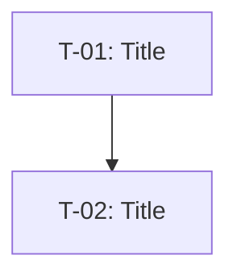
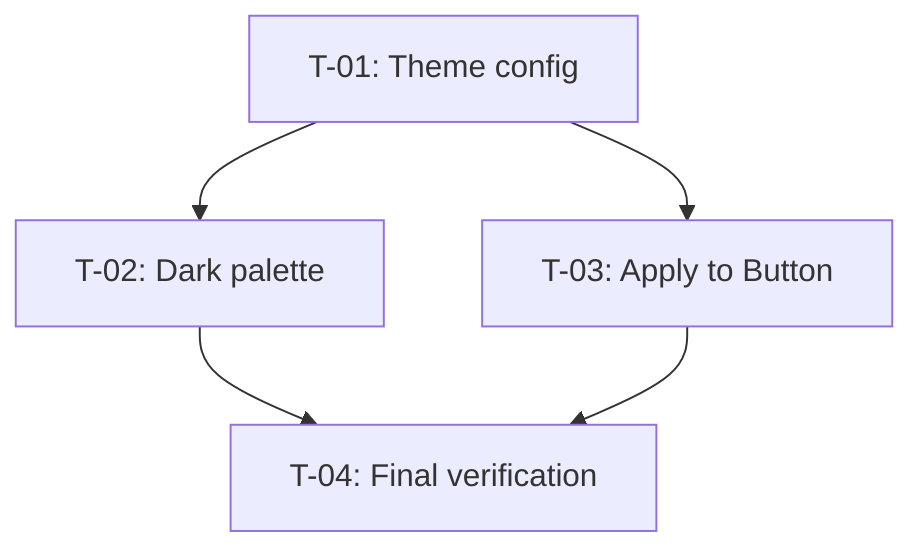

# Purpose

Break down large features into tickets optimized for AI agent execution.

**Output:**
- Tickets: Vertical slices implementing functional requirements
- Dependencies: Mermaid graph showing execution order (optional)

**Process:**
- If plan exists in a file: Update that file with tickets and dependencies
- If plan is not in a file: Create `artefacts/plan-{title}.md` with tickets and dependencies

# Output format

## Tickets

```markdown
### T-01: [Title]
**Description:** As a [user], I want [feature] so that [benefit].

**Acceptance Criteria:**
- [ ] Specific verifiable criterion
- [ ] Another criterion
```

## Dependencies



# Guidelines

## Vertical slicing (by feature, not layer)
- ❌ Bad: "T-01: HTML", "T-002: CSS", "T-003: DB Schema"
- ✅ Good: "T-01: Header (HTML+CSS)", "T-002: Save User (API+DB)"

## Walking skeleton (simplest working path first)
- T-01 should often be a "structure" ticket: types, interfaces, stubs
- Start with minimal end-to-end implementation that works but does almost nothing
  - Example: Button → API endpoint → hardcoded response → UI update
  - Proves integration before adding logic
- Later tickets add real logic, validation, error handling
- Better: working trivial implementation than perfect isolated component

## Stub patterns (structure-first tickets)

Recommend T-01 as a "structure" ticket that establishes contracts before logic:

| Pattern | When to use | Example |
|---------|-------------|---------|
| Return empty/hardcoded | Data not yet implemented | `return []` or `return { id: 1 }` |
| `console.log("TODO: X")` | Function body placeholder | Proves wiring works |
| Throw "Not implemented" | Required interface method | `throw new Error("T-02")` |
| `.skip` or `.todo` tests | Tests for future tickets | `it.skip("saves to DB", ...)` |

**Why stubs help AI execution:**
- Smaller first ticket = faster feedback loop
- Proves integration before logic
- Later tickets fill in real implementation

## Acceptance criteria
- Must be verifiable, not vague
  - ✅ Good: "Button shows confirmation dialog before deleting"
  - ❌ Bad: "Works correctly"
- Include test cases as checkboxes: `- [ ] Test: X happens when Y`
- Bundle tests with each ticket — avoid separate "write tests" tickets

## Ticket scope
- Small enough for one focused AI agent session
- Independently completable when possible
- Use T-01, T-02 numbering
- Focus on core functionality, defer edge cases to later iterations

## Sizing guidelines
- **Target:** 50-150 lines of meaningful changes per ticket
- **Too large:** If exceeding ~200 lines, split further
- **Include estimate:** Add `**Est. lines:** ~80` to each ticket

## Dependencies
- Only create graph if tickets have dependencies
- Use Mermaid graph (see format above)
- Do NOT add "Dependencies" field to individual tickets
- Arrows show "must complete before" relationship

## Quality gates and final verification
- Each ticket should verify work: run relevant tests, type checks during implementation
- Always include final verification ticket as last ticket:
  - Runs all quality gates: tests, type checks, lint
  - Manual verification via devtools/UI
  - Cleanup implementation artifacts:
    - Remove extraneous comments (TODO, debug notes, exploratory comments)
    - Limit JSDoc to 2 lines max unless specifically required or significant
    - Remove redundant tests — goal: highest coverage for least tests
    - Keep essential tests, remove exploratory/debugging tests
  - Ensures deliverable is production-ready

# Example

## Tickets

### T-01: Theme config structure (stubs)
**Description:** As a developer, I want theme config foundation so that components can consume theme values.
**Est. lines:** ~40

**Acceptance Criteria:**
- [ ] ThemeConfig type defined
- [ ] `getTheme()` returns hardcoded default theme
- [ ] Test: Config exports valid theme object

### T-02: Dark theme palette
**Description:** As a developer, I want dark mode colours defined.
**Est. lines:** ~60

**Acceptance Criteria:**
- [ ] Define dark mode colour values in config
- [ ] `getTheme("dark")` returns dark palette
- [ ] Test: Dark palette has required colour keys

### T-03: Apply theme to Button
**Description:** As a user, I want Button to respect theme.
**Est. lines:** ~80

**Acceptance Criteria:**
- [ ] Button consumes theme config
- [ ] Button renders with theme colours
- [ ] Test: Button snapshot matches themed output

### T-04: Final verification
**Description:** As a developer, I want all quality gates to pass so that the feature is production-ready.
**Est. lines:** ~20 (cleanup only)

**Acceptance Criteria:**
- [ ] All tests pass
- [ ] Type checks pass
- [ ] Lint passes
- [ ] Manual verification: theme switches correctly in devtools
- [ ] Remove TODO comments from T-01 stubs
- [ ] Remove `.skip` from any deferred tests

## Dependencies


