# Tech design

**Process:**
- If plan exists in a file: Update that file with sections below
- If plan is not in a file: Create `artefacts/plan-{title}.md` with sections below

## Sections

### Call graph

Visualizes how functions, modules, systems interconnect.

**When to include:** Multiple interconnected functions, complex dependencies, system integration points, architectural changes

**Structure:** Subgraphs (by file/module), nodes (functions/components), reference letters [A][B], status markers (🟢🟡🔴), arrows with descriptive labels ("uses", "calls", "renders via")

**Include:** Changed functions/components, what uses them, integration points, data flow direction  
**Exclude:** Internal implementation details, trivial helpers, standard library/framework functions, tests

**Best practices:** Focus on changed components + immediate dependencies, search codebase for usage, trace to entry points (API calls, CLI actions), correlate nodes to pseudocode using reference letters

**Example:**

```mermaid
flowchart TD
    subgraph api["api/tasks/[id]/complete.ts"]
        POST["POST handler [🟡 UPDATED]"]
    end
    
    subgraph tasks["tasks/complete.ts"]
        A["completeTask(taskId) [🟢 NEW] [A]"]
    end
    
    subgraph db["@/lib/prisma"]
        Prisma["prisma.task"]
    end
    
    POST -->|"calls"| A
    A -->|"queries & updates"| Prisma
```



Key elements shown:
- **Subgraphs** for each file/module
- **Reference letters** `[A]` to correlate with pseudocode
- **Status markers** `[🟢 NEW]` `[🟡 UPDATED]`
- **Descriptive arrows** showing relationships
- **Entry points** (API route) and **integration points** (Prisma)

### Data models

TypeScript interfaces or database schemas showing data structure.

**Format:** Use TypeScript interface syntax or Prisma schema format. Include only models relevant to the feature.

See [Example plan](#example-comprehensive-planning-document) for format.

### Pseudocode breakdown

Show logic flow with reference letters [A][B]. Mark status: 🟢 NEW, 🟡 UPDATED, 🔴 REMOVED. Use "sh" syntax. Keep JSX minimal.

**Key guidelines:** Include descriptive comments (logic flow, business rules), use `→ render <Component>` not full JSX trees, focus on logic not rendering details

### Files

List new, modified, and removed files.

**Format:** Use bold prefixes: `**New:**`, `**Modified:**`, `**Removed:**` followed by comma-separated file paths.

See [Example plan](#example-comprehensive-planning-document) for format.

### CSS classes

List CSS class names for UI features.

**Format:** Dash-prefixed list with class name and brief description.

See [Example plan](#example-comprehensive-planning-document) for format.

### Testing strategy

List tests needed with run commands.

**Include:** Test data/fixtures used, dependencies needing mocks + why (external APIs, databases, time-dependent), exact command to run tests

**Format:** 1 line per test (name only). Add 1-line comment after if key info needed.

## Examples

### Example: Comprehensive planning document

This example shows ALL available sections in a combined spec. **Include only sections relevant to your feature.**

````markdown
# Plan: Task notification system

.
.
.

## Call graph

```mermaid
flowchart TD
    subgraph api["api/notifications/route.ts"]
        GET["GET handler [🟢 NEW]"]
    end
    
    subgraph notify["notifications/create.ts"]
        A["createNotification(userId, taskId, type) [🟢 NEW] [A]"]
    end
    
    subgraph email["email/queue.ts"]
        B["enqueueEmail(notification) [🟢 NEW] [B]"]
    end
    
    subgraph db["@/lib/prisma"]
        Prisma["prisma.notification"]
    end
    
    GET -->|"queries"| Prisma
    A -->|"persists"| Prisma
    A -->|"triggers"| B
```



## Data models

```typescript
interface Notification {
  id: string;
  userId: string;
  taskId: string;
  type: "comment" | "status" | "mention";
  createdAt: Date;
  read: boolean;
}
```

## Pseudocode breakdown

**createNotification:** persist and trigger email [A]

```sh
# == notifications/create.ts ==

createNotification(userId, taskId, type) # [🟢 NEW] [A]
  → notification = { userId, taskId, type, read: false }
  → prisma.notification.create({ data: notification })
  → enqueueEmail(notification)
  → return { ok: true, notification }
```

**enqueueEmail:** add to email queue [B]

```sh
# == email/queue.ts ==

enqueueEmail(notification) # [🟢 NEW] [B]
  → user = prisma.user.findUnique({ where: { id: notification.userId } })
  → emailQueue.add('notification', { to: user.email, ...notification })
```

## Files

**New:** `src/notifications/create.ts`, `src/email/queue.ts`, `src/api/notifications/route.ts`, `src/components/NotificationPanel.tsx`
**Modified:** `prisma/schema.prisma` — Add Notification model

## CSS classes

- `.notification-panel` - Panel container
- `.notification-item` - Individual notification
- `.notification-unread` - Unread state styling
- `.bell-icon-badge` - Unread count badge

## Testing strategy

**Run:** `npx vitest src/notifications/`

**Mocks:** `@/lib/prisma`, `email/queue`
**Fixtures:** `PENDING_TASK`, `MOCK_USER`

**Tests:**
- creates notification with correct fields
- enqueues email after creating notification
- returns all unread notifications for user
- marks notification as read
- handles duplicate events idempotently

## Quality gates

- `pnpm typecheck` - Type checking
- `pnpm lint` - Linting
- `pnpm test` - Unit tests

For UI work: Verify in browser via http://localhost:3000/notifications

.
.
.
````

