# Product requirements

**Process:**
- If plan exists in a file: Update that file with sections below
- If plan is not in a file: Create `artefacts/plan-{title}.md` with sections below

## About product requirements

**Good product requirements qualities:**

- Technical solution plan can be made from it
- Edge cases/error scenarios addressed
- Engineers can estimate without many questions

## Sections

### Functional requirements

Product-focused: **what** users can do and system does, not **how** it's implemented.

**Include:** User actions, system responses, observable behavior, timing constraints  
**Exclude:** Function names, cache layers, data structures → Technical requirements or Technical design sections

**Format:** Em-dash pattern (see [Formatting standards](#formatting-standards))

**Good examples:**
- **F1.1. Contact sync** — Changes to contacts sync to mirror workspace within 2 seconds
- **F1.2. Status tracking** — System tracks when contacts were last viewed by user

**Bad examples (implementation details):**
- **F1.1** `updateContact()` calls mirror function with `touchUpdatedAt: true`
- **F1.2** Uses Redis cache with 5-minute TTL

**Test:** Mentions function names/parameters/cache? → Wrong section

See [Example plan](#example-comprehensive-planning-document) for format.

### Technical requirements

System-level technical contracts, integration points, API specifications. Technical **what** (contracts, interfaces, data flows) without implementation **how**.

**Include:** API contracts, integration behaviors, WebSocket events, database triggers, third-party service calls, data sync specifications  
**Exclude:** Implementation approach (→ Technical design sections), error handling strategies (→ Technical design sections), function internal logic (→ Technical design sections)

**Format:** Em-dash pattern (see [Formatting standards](#formatting-standards))

**Boundary clarification:**
- **Functional requirements** → User-observable behavior, product features, UI interactions ("User receives notification when...")
- **Technical requirements** → System contracts, API specifications, integration points, data flows ("`updateContact()` accepts `touchUpdatedAt` parameter...")
- **Technical design sections** → Implementation approach, function design, error handling strategies ("Use try/catch for database errors...")

See [Example plan](#example-comprehensive-planning-document) for format.

### Technical constraints

Technology limitations and platform requirements that constrain implementation choices. What technologies **must** or **cannot** be used.

**Include:** Tech stack requirements, platform limitations, browser support, library versions, infrastructure constraints, performance budgets  
**Exclude:** System integration contracts (→ Technical requirements), implementation approach (→ Technical design sections)

**Format:** Em-dash pattern (see [Formatting standards](#formatting-standards))

See [Example plan](#example-comprehensive-planning-document) for format.

### Quality gates

Commands that must pass for every piece of work.

See [Example plan](#example-comprehensive-planning-document) for format.

### Design considerations

Document important design decisions that don't fit into functional requirements.

**Format:** Em-dash pattern with DC1, DC2... identifiers

See [Example plan](#example-comprehensive-planning-document) for format.

### Screen interactions diagram

Visualize UI structure, component hierarchy, interactive flows. Include when feature has multiple screens/views or complex user interactions.

**Structure:**

1. Top-level subgraphs: Screens/pages with URL paths
2. Nested subgraphs: Group related UI elements
3. Nodes: Individual UI elements (buttons, links, inputs)
4. Dashed arrows (`-.->`) with labels for user actions
5. Include "Key entities" subsection listing pages/URLs, UI components, API endpoints

**Include:** Screens/URLs, interactive elements, navigation flows, modal/drawer interactions  
**Exclude:** Non-interactive elements, internal component hierarchy, styling, data flow

See [Formatting standards](#formatting-standards) for diagram rules.

### User flow diagram

Show end-to-end user journey for multi-step processes or cross-user interactions.

**Structure:**

1. Nodes: States, actions, events in user journey
2. Solid arrows (`-->`) with trigger/condition labels
3. Include system responses when relevant to flow

**Include:** User actions, system responses, conditional branches  
**Exclude:** Implementation details, error handling (unless critical), UI component specifics

See [Formatting standards](#formatting-standards) for diagram rules.

## Example

````markdown
# Plan: Task notification system

## Initial ask
...

## Problem statement
Users miss updates by manually checking task list.

## Solution overview
1. Real-time notifications via WebSocket for immediate updates
2. Email notifications for missed in-app updates
3. Notification centre for browsing history

## Functional requirements

### F1: Notification events
- **F1.1. Task comments** — User receives notification when someone comments on watched task
- **F1.2. Status changes** — User receives notification when task status changes
- **F1.3. Mentions** — User receives notification when mentioned in comments/descriptions

Each notification: event type, task title (linked), who triggered it, timestamp.

### F2: Notification delivery
- **F2.1. Real-time** — Notifications appear in-app within 2 seconds of event
- **F2.2. Email** — Email notifications sent within 5 minutes for unwatched in-app notifications
- **F2.3. Notification centre** — User can view all notifications in dedicated panel

## Technical requirements

### TR1: Real-time delivery
- **TR1.1. WebSocket events** — Server emits `notification` event: `{userId, eventType, taskId, timestamp, triggeredBy}`
- **TR1.2. Connection handling** — Client reconnects automatically on disconnect, fetches missed notifications

### TR2: Email queue
- **TR2.1. Queue contract** — Accepts events via `emailQueue.add('notification', payload)` with notification schema
- **TR2.2. Batch processing** — Groups notifications by user, sends max 1 email per 5 minutes per user

## Non-functional requirements
- **NF1. Performance** — Real-time notifications delivered within 2 seconds
- **NF2. Scalability** — Email queue handles 1000+ notifications/min

## Technical constraints
- **TC1. WebSocket library** — Must use existing Socket.io v4 installation
- **TC2. Email service** — Must use existing SendGrid integration

## Design considerations
- **DC1. Idempotency** — Duplicate events produce single notification
- **DC2. Offline handling** — Missed notifications fetched on reconnect

## Screen interactions

```mermaid
flowchart TD
    subgraph Dashboard["/dashboard - Dashboard page"]
        Bell["🔔 Bell icon"]
        NotifPanelNode["Notification panel"]
    end
    
    subgraph NotifPanelContent["Notification panel"]
        NotifList["Notification list"]
        MarkRead["Mark all read button"]
    end
    
    Bell -.->|"click"| NotifPanelContent
    NotifList -.->|"click notification"| TaskPage["/tasks/[id] - Task page"]
    MarkRead -.->|"click"| NotifPanelContent
```



**Key entities:**
- **Pages:** `/dashboard`, `/tasks/[id]`
- **Components:** `BellIcon`, `NotificationPanel`, `NotificationList`
- **API endpoints:** `GET /api/notifications`, `POST /api/notifications/[id]/read`

## User flow


.
.
.
````
