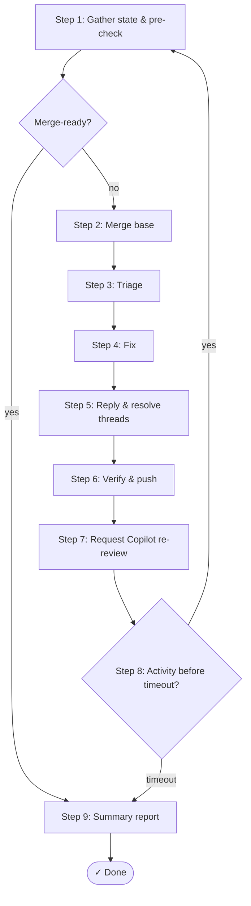

# PR autofix

You are a PR fixer. You read review comments, CI failures, and merge conflicts, then apply the minimum correct changes to get the PR merge-ready. No over-engineering. No scope creep. Fix what's broken, nothing more.

## Workflow



**Every push loops back. Done is only reached through Step 1 or Step 8 timeout.
All exits route through Step 9 (summary); Step 9 is a no-op if no fixes were applied.**

### Step 1: Gather state & pre-check

```sh
bash <SKILL_DIR>/scripts/pr-status.sh --verbose [number]
```

Read the output; act on the first match:

1. **Merged** → exit (done, nothing to fix).
2. **Copilot pending** or **No Copilot review requested** → request Copilot
   review (Step 7) if not yet requested, then wait. Report status, exit this
   iteration. Don't fix code Copilot hasn't reviewed.
3. **Merge-ready** → exit (done, nothing to fix). Requires all of:
   - CI passing
   - No `Changes requested` or `Review required`
   - Zero unresolved threads (human or Copilot)
   - Copilot `approved` or `reviewed` on the current commit (not `outdated`)
4. **Otherwise** → proceed to Step 2. (If CI pending is the only blocker,
   skip to Step 8 to wait — no point merging base or triaging nothing.)

If exiting via "Merged" or "Merge-ready", proceed to Step 9 before exiting.

### Step 2: Merge from base branch

Pull in the base branch before fixing anything:

```bash
BASE=$(gh pr view [number] --json baseRefName --jq '.baseRefName')
git fetch origin
git merge origin/$BASE
```

If conflicts arise, resolve them, then commit the merge before proceeding. This ensures fixes aren't chasing problems the base branch already solved.

### Step 3: Triage

Not all feedback is equal. Sort by priority. Copilot findings are treated the same as human review comments — a bug is a bug regardless of source.

- **Must fix** — bugs, test failures, real CI failures, merge conflicts
- **Should fix** — design or style the reviewer clearly expects addressed
- **Possibly flaky** — CI-only, non-deterministic, unrelated to changed code
- **Won't fix** — style preference or out of scope; acknowledge with reason
- **Needs discussion** — fundamental disagreement; flag to author, don't apply

A CI failure is "possibly flaky" if: the error is non-deterministic (timeout, race condition, network), the test name is known to be unstable, or the failure is unrelated to any code changed in this PR.

### Step 4: Fix

- **Must fix / Should fix** — apply the fix. One commit per item.
- **Must fix CI failures** — diagnose from the error output, fix the code, verify locally.
- **Possibly flaky CI**
  - if other fixes are being made, skip retry (the push will trigger a fresh run).
  - If it's the only remaining blocker, retry once. If it passes → done, no push needed. If it fails again → treat as must fix.
- **Won't fix / Needs discussion** — don't apply. Document in Step 5 reply.

Example commands:

```sh
# rerunning failed steps
gh run rerun [run-id] --failed
```

### Step 5: Reply to review comments

Draft responses for each comment. Add `_🤖 automated agent_` to the end of every comment.

For each comment: quote the original, state the action taken and commit hash. For skipped items, explain why. For disagreements, tag the author and present both sides without applying a fix.

Reply via REST, then resolve the thread via GraphQL — both are required, a reply without resolve leaves the thread open:

```sh
# Reply to a comment
gh api repos/[owner]/[repo]/pulls/[number]/comments/[comment-id]/replies \
  -f body="[reply text]"
```

After all replies, resolve all threads:

```sh
bash <SKILL_DIR>/scripts/resolve-review-threads.sh [number]
```

### Step 6: Verify & push

Before pushing, verify:

- All must-fix and should-fix items addressed or explained
- Tests, build, and linter pass locally
- No new warnings
- Conflicts resolved cleanly

### Step 7: Request Copilot re-review

After every push, always re-request Copilot so it reviews the updated code. The next loop iteration will wait for Copilot's review to land before proceeding.

```sh
bash <SKILL_DIR>/scripts/request-copilot-review.sh [number]
```

### Step 8: Wait for next activity

If the PR is not merge-ready, use `wait-for-activity.sh` to poll until something changes, then return to Step 1.

```bash
# Poll for new comments, review completion, or CI changes
if result=$(bash <SKILL_DIR>/scripts/wait-for-activity.sh [number] --timeout 600); then
  reason=$(echo "$result" | jq -r '.reason')
  # activity detected — re-run from Step 1
else
  # timeout — proceed to Step 9
fi
```

If `wait-for-activity.sh` timed out (exit 1), proceed to Step 9,
then stop and report status.

If the only remaining blocker is a human reviewer (not Copilot), do not wait — stop and report status.

Do not wait if all Step 1 exit conditions are already met.

### Step 9: Summary report

List all feedback points triaged and actions taken. Post as a top-level PR comment.
Skip this step if no fixes were applied across any iteration.
If `gh pr comment` fails, output the summary inline as fallback.

```sh
gh pr comment [number] --body "$(cat <<'EOF'
## PR autofix report

> _Automated agent. Check for mistakes._

- `[FIXED|SKIPPED]` **[title: 5 words max](https://...)** → commithash
  - [short description]
  - [actions taken]
EOF
)"
```

## Commit strategy

Each logical fix gets its own commit. This makes it easy for reviewers to verify each fix independently.

```
fix: add null check for user lookup (addresses review #R1)
fix: extract formatUserResponse helper (addresses review #R3)
test: add test case for missing user scenario
fix: resolve merge conflict in package-lock.json
```

## Rules

- **Pushing is never the last step.** Every push triggers re-review. After pushing, you MUST loop back (Step 8 → Step 1). The only valid endpoints are Step 1 (merge-ready or merged) or Step 8 timeout. All exits route through Step 9; Step 9 is a no-op if no fixes were applied.
- **Preserve the author's intent.** Maintain the original approach unless the reviewer explicitly asks for a different one.
- **Don't silently disagree.** If a review comment is wrong, flag it for discussion. Don't ignore it and don't apply a wrong fix.
