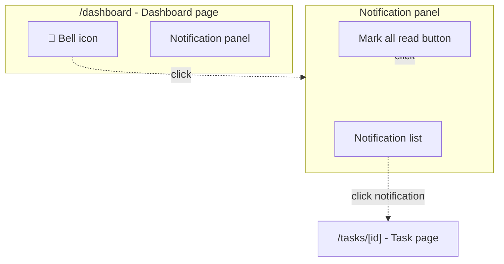
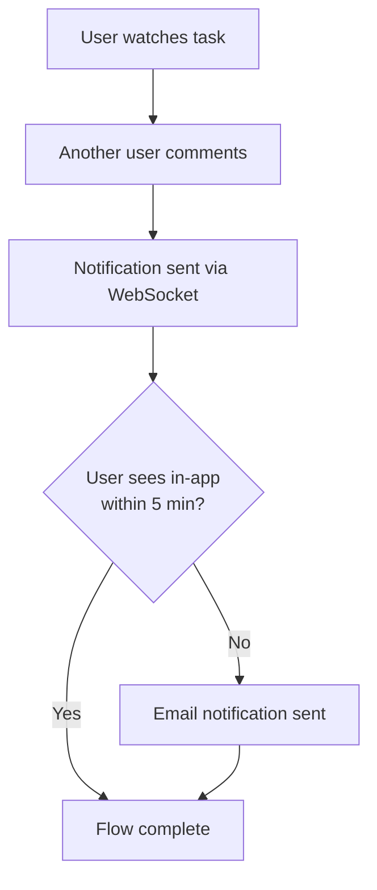

# Product requirements

**Process:**
- If plan exists in a file: Update that file with sections below
- If a plan path is already known but the file is not on disk yet: Create the file at that exact path with sections below
- If no plan path is known yet: Create `artefacts/plan-<title>.md` with sections below

## About product requirements

**Good product requirements qualities:**

- Technical solution plan can be made from it
- Edge cases/error scenarios addressed
- Engineers can estimate without many questions

## Sections

## Requirement item format

Applies to Functional requirements, Technical requirements, Non-functional requirements,
Technical constraints, and Design considerations.

- Use `- **<PREFIX>1.1. Short title**` followed by nested detail bullets
- Keep `Short title` to 5 words max
- Use the first nested bullet for the short description
- Keep that first bullet to 10 words max

**Prefixes:**
- `F` = Functional requirements
- `TR` = Technical requirements
- `NF` = Non-functional requirements
- `TC` = Technical constraints
- `DC` = Design considerations

### Functional requirements

Product-focused: **what** users can do and system does, not **how** it's implemented.

**Include:** User actions, system responses, observable behavior, timing constraints  
**Exclude:** Function names, cache layers, data structures → Technical requirements or Technical design sections

Use the shared requirement item format with prefix `F`.

**Good examples:**
- **F1.1. Contact sync**
  - Mirror workspace changes within 2 seconds
  - Applies to create, update, and archive actions
- **F1.2. Status tracking**
  - Show when a contact was last viewed
  - Timestamp is visible to the current user

**Bad examples (implementation details):**
- **F1.1. Mirror call**
  - `updateContact()` passes `touchUpdatedAt: true`
  - Describes a function contract, not user-visible behaviour
- **F1.2. Cache layer**
  - Uses Redis cache with 5-minute TTL
  - Describes implementation, not product behaviour

**Test:** Mentions function names/parameters/cache? → Wrong section

See [Example plan](#example-comprehensive-planning-document) for format.

### Technical requirements

System-level technical contracts, integration points, API specifications. Technical **what** (contracts, interfaces, data flows) without implementation **how**.

**Include:** API contracts, integration behaviors, WebSocket events, database triggers, third-party service calls, data sync specifications  
**Exclude:** Implementation approach (→ Technical design sections), error handling strategies (→ Technical design sections), function internal logic (→ Technical design sections)

Use the shared requirement item format with prefix `TR`.

**Boundary clarification:**
- **Functional requirements** → User-observable behavior, product features, UI interactions ("User receives notification when...")
- **Technical requirements** → System contracts, API specifications, integration points, data flows ("`updateContact()` accepts `touchUpdatedAt` parameter...")
- **Technical design sections** → Implementation approach, function design, error handling strategies ("Use try/catch for database errors...")

See [Example plan](#example-comprehensive-planning-document) for format.

### Non-functional requirements

Quality attributes and measurable system characteristics that define acceptable operation.

**Include:** Performance targets, latency budgets, throughput expectations, scalability limits, reliability expectations, security expectations  
**Exclude:** User-visible feature behaviour (→ Functional requirements), API contracts (→ Technical requirements), implementation approach (→ Technical design sections)

Use the shared requirement item format with prefix `NF`.

See [Example plan](#example-comprehensive-planning-document) for format.

### Technical constraints

Technology limitations and platform requirements that constrain implementation choices. What technologies **must** or **cannot** be used.

**Include:** Tech stack requirements, platform limitations, browser support, library versions, infrastructure constraints, performance budgets  
**Exclude:** System integration contracts (→ Technical requirements), implementation approach (→ Technical design sections)

Use the shared requirement item format with prefix `TC`.

See [Example plan](#example-comprehensive-planning-document) for format.

### Quality gates

Commands that must pass for every piece of work.

See [Example plan](#example-comprehensive-planning-document) for format.

### Design considerations

Document important design decisions that don't fit into functional requirements.

Use the shared requirement item format with prefix `DC`.

See [Example plan](#example-comprehensive-planning-document) for format.

### Screen interactions diagram

Visualize UI structure, component hierarchy, interactive flows. Include when feature has multiple screens/views or complex user interactions.

**Structure:**

1. Top-level subgraphs: Screens/pages with URL paths
2. Nested subgraphs: Group related UI elements
3. Nodes: Individual UI elements (buttons, links, inputs)
4. Dashed arrows (`-.->`) with labels for user actions
5. Include "Key entities" subsection listing pages/URLs, UI components, API endpoints

**Include:** Screens/URLs, interactive elements, navigation flows, modal/drawer interactions  
**Exclude:** Non-interactive elements, internal component hierarchy, styling, data flow

See [Formatting standards](#formatting-standards) for diagram rules.

### User flow diagram

Show end-to-end user journey for multi-step processes or cross-user interactions.

**Structure:**

1. Nodes: States, actions, events in user journey
2. Solid arrows (`-->`) with trigger/condition labels
3. Include system responses when relevant to flow

**Include:** User actions, system responses, conditional branches  
**Exclude:** Implementation details, error handling (unless critical), UI component specifics

See [Formatting standards](#formatting-standards) for diagram rules.

## Example

````markdown
# Plan: Task notification system

## Initial ask
...

## Problem statement
Users miss updates by manually checking task list.

## Solution overview
1. Real-time notifications via WebSocket for immediate updates
2. Email notifications for missed in-app updates
3. Notification centre for browsing history

## Functional requirements

### F1: Notification events
- **F1.1. Task comments**
  - Notify watchers when someone comments on a watched task
  - Include event type, task title, actor, timestamp, and deep link
- **F1.2. Status changes**
  - Notify watchers when watched task status changes
  - Include the previous and new status values
- **F1.3. Mentions**
  - Notify users when they are mentioned
  - Applies to comments and task descriptions

### F2: Notification delivery
- **F2.1. Real-time delivery**
  - Show in-app notifications within 2 seconds
  - Applies while the user has an active session
- **F2.2. Email fallback**
  - Email unseen notifications within 5 minutes
  - Skip email when the notification was already read in-app
- **F2.3. Notification centre**
  - Let users browse notification history
  - Support opening the related task from each entry

## Technical requirements

### TR1: Real-time delivery
- **TR1.1. Notification event**
  - Emit `notification` events with the shared payload schema
  - Payload includes `userId`, `eventType`, `taskId`, `timestamp`, `triggeredBy`
- **TR1.2. Reconnect sync**
  - Fetch missed notifications after reconnect
  - Client reconnects automatically after disconnect

### TR2: Email queue
- **TR2.1. Queue contract**
  - Queue accepts notification payloads under one job type
  - Use `emailQueue.add('notification', payload)`
- **TR2.2. Batch window**
  - Send at most one email every 5 minutes
  - Group queued notifications by user

## Non-functional requirements
- **NF1.1. Delivery latency**
  - Deliver in-app notifications within 2 seconds
  - Measure from event creation to client render
- **NF1.2. Queue throughput**
  - Handle 1000 notifications per minute
  - Sustained bursts should not drop events

## Technical constraints
- **TC1.1. WebSocket library**
  - Use existing Socket.io v4 installation
  - Do not introduce a second realtime transport
- **TC1.2. Email service**
  - Use existing SendGrid integration
  - Reuse current authentication and sender configuration

## Design considerations
- **DC1.1. Idempotency**
  - Collapse duplicate events into one notification
  - Prevent repeated alerts for the same source action
- **DC1.2. Offline recovery**
  - Backfill missed notifications after reconnect
  - Prefer server reconciliation over client-side guesswork

## Screen interactions



**Key entities:**
- **Pages:** `/dashboard`, `/tasks/[id]`
- **Components:** `BellIcon`, `NotificationPanel`, `NotificationList`
- **API endpoints:** `GET /api/notifications`, `POST /api/notifications/[id]/read`

## User flow



.
.
.
````
