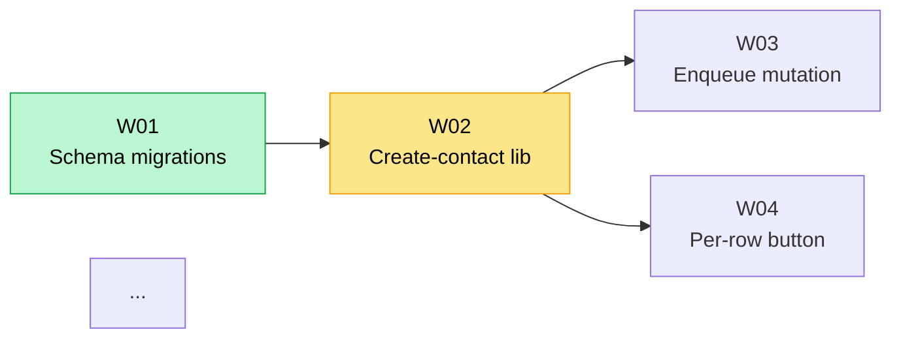

## What this is

- A single living doc for a multi-slice project (spans several tickets/PRs over time), not a one-shot design doc.
- It accumulates as work progresses — new slices, decisions, and grounded facts get appended rather than rewritten.

## Getting started

1. Ask the user for the subject matter. Derive a slug, create `~/.notebooks/<yy><mm>-<slug>/index.megaplan.md`.
2. Populate from the template below: title, one-line summary, `**Status:** seed`. All other sections empty — fill them as you go using the interview loop (see **Filling sections**).
3. Once the completeness checklist passes, flip to `**Status:** draft`.

## Structure

Sections in order. Tagged sections use short IDs so others can cross-reference them without repeating content:

- **Links**
- **Summary**
- **Scope**
  - Goals / Non-goals, each bullet says why.
  - What must the system do? What must it *not* do?
  - For each goal/non-goal: *why*? What does excluding it enable?
  - Are there adjacent features that look in-scope but aren't? Call them out explicitly.
- **Work plan**
  - Slices, each with its tickets in dependency order; include PRs and statuses if known.
  - Keep entries lean — see Work plan hygiene below.
  - **Integration branches** (optional H3, add when relevant) — branches merging several in-flight PRs together for combined manual verification; not meant to land on `main` themselves.
  - **Ordering** — dependency graph; keep it simple, no descriptions
- **Solution options** (optional, add when a problem space has multiple viable approaches to weigh before deciding)
  - One H3 per problem space, one bold line per option (`**Option A**`, `**Option B**`, ...).
  - Tag each H3 with what raised it and what it feeds, `(<source ID> → <outcome ID>, ...)`: source is the `Q0N`/`N0N` that prompted it (omit if none — e.g. it surfaced during design, not from a question or inbox item); outcomes are the `D0N`/`W0N`/`I0N`/etc it resolves into once decided.
  - Update the outcome refs once the option is picked — don't leave them pointing at IDs that no longer exist.
  - Once resolved, fold the chosen option into a Decision and remove this section (or leave it as a record of what was considered).
- **Decisions** (`D01`, `D02`, ...)
  - Decision, why, implication.
  - For each design fork: lay out 2–3 options with trade-offs. Recommend one.
- **Inbox** (`N01`, `N02`, ...)
  - Incoming requests that still need triage; removed and turned into requirements as they're understood.
- **Requirements** (`R01`, `R02`, ...)
  - The actual spec: types, arbitration rules, worked examples.
  - Is there an existing pattern in the codebase to reuse?
  - Does it interact with another requirement? Resolve ordering first.
  - Can it be illustrated with a worked example (input → output)?
- **Design** (`E01`, `E02`, ...)
  - Things that define the contract of how pieces operate together
  - eg: data models (types + example + invariants), state machines with transition tables, API schemas, storage keys, repo layout, component trees
- **Risks** (`I01`, `I02`, ...)
  - Known gaps accepted as out-of-scope; include mitigations.
  - What's explicitly out-of-scope that could bite us?
- **Open questions** (`Q01`, `Q02`, ...)
  - Unresolved decisions blocking scope.
  - Promoted to a Decision as each is answered (leave the ID gap, don't renumber).
- **Appendix: Grounded facts** (`F01`, `F02`, ...)
  - Research relevant to task. eg: real API responses, third-party docs, source code findings.
- **Sources**
  - File paths and functions consulted, for traceability; live docs links used as reference.

Guidelines:

- Place some sections inside `<details>` — they are too noisy for a regular review.
- Use nested bullet styles (eg Requirements) for readability

## Filling sections

Interview the user relentlessly through each section. Walk each branch of the design tree before moving to the next — resolve dependencies between decisions one-by-one. For every question, provide your recommended answer.

Proactively research facts before asking: inspect the codebase for existing patterns, web-search for third-party constraints. If a question can be answered by exploring the repo, explore it instead of asking.

## Inbox triage

Incoming items get triaged with a concrete verdict:

- **Promote** → move to Requirements or Work plan with suggested markdown.
- **Close** → remove with reason (stale, duplicate, won't-fix).
- **Merge** → fold into an existing item.
- **Clarify** → pose a specific question back to the user.

## Completeness checklist

Before marking **Status:** draft and starting implementation:

- **Ready to start** — enough detail to begin the first slice?
- **Has work items** — every requirement mapped to a ticket; each reasonably sized?
- **Has goals** — clear, scoped goals and non-goals with reasons?
- **Has requirements** — if relevant: data model, API schema, screen inventory covered?

If gaps, fill them before flipping the status.

## Guidelines

- Omit sections not needed
- Add sections as necessary

### Work plan hygiene

Keep each entry to one line: **status emoji · ticket · short title · (requirement refs) · PR link(s)**, plus at most one short note only if it's *forward-looking and actionable* (e.g. "needs rework — X", "blocked on #NNNN").

- Reference PRs by bare number (`#14669`), not prose. One link is enough.
- **Cut the history.** No merge dates, "merged 9 Jul 03:01", "was stuck In Progress", superseded-branch trivia, CI-green/red narration, who-approved-what, diff stats (`+14/-2`). That belongs in git/Linear, not the living plan.
- A done item (✅) needs only the PR link — no story of how it got there.
- If a status note isn't something a reader would *act on*, delete it.
- Assign IDs to work items as `W01`, `W02`, … — when a work item is turned into a ticket, replace the `W0x` ID with the ticket ID.
- When an agent is working an item in a worktree, append the branch, labelled:

  ```
  - ✏️ [ABC-123](url) — **Authentication API** (R14) — [#14999](url) — Branch: `feat/auth-api`
  ```

  Record the branch alongside the PR link (never the worktree path or a muxer handle) —
  the path is derivable (`wt list --format json`) and muxer handles go stale (indexes get reused).
- **Strip the branch once the item is ✅.** A done item needs only the PR link.

```
❯ **Work item (pre-ticket):**
  - 🟡 W01 — **Add contact merge endpoint** (R01, R02)
    - POST /contacts/:id/merge, accepts target+source IDs, moves all related records
    - dedup logic reuses existing MergeService from ContactMerge.ts

❯ **After ticket created, PR up:**
  - ✏️ [ABC-123](url) — **Add contact merge endpoint** (R01, R02) — [PR #14670](url)
    - ...
```

### Design entries

Design entries are contracts, not prose. Typical entries:

- **Data model** — type definitions, one concrete example value, invariants (rules a lint/test must enforce)
- **State machine** — state + action types, then a transition table (action × guard → result); guards capture the edge cases
- **Storage** — keys, shape, access rules (eg effects-only for `localStorage` in SSR apps)
- **Repo layout** — file tree mapping each artifact to its work item
- **Component tree** — component hierarchy with who owns state and how events flow up

Use code blocks and markdown tables over paragraphs. If a data model has a design fork (eg a field that could be two shapes), record it as a Decision with options + recommendation, and reference it from the Design entry (D10).

## Template

````markdown
# <Project name> megaplan

> One-sentence description of what this adds/changes and to what system.

**Status:** seed

## Links

- [Linear project](<url>)
- [Notion one-pager](<url>)
- [Repo](<url>) — optionally `owner/name — ~/local/path` when agents need a working directory

## Summary

- ...
- ...

## Scope

### Goals

- **<Goal>** (G01)
  - ...
  - ...

- ...

### Non-goals

- **<Excluded thing>** (X01)
  - ...
  - ...
- ...

> ID goes on the title line and nothing else follows it — put the description and rationale in sub-bullets. Goals are G0N, non-goals X0N.

## Work plan

### Slice 1

- 🟡 [<TICKET-ID>](<url>) — **<short title>**
  - ...
  - ...

- ✅ [<TICKET-ID>](<url>) — **<short title>** — [PR #<n>](<url>) — Branch: `...`
  - ...
  - ...

### Slice N: <name>

- ...

### Integration branches

> Branches that merge several in-flight PRs together for combined manual verification — not meant to be merged to `main` themselves; superseded once the real PRs land.

- `<branch-name>` — merges PRs for combined testing: [#<n>](<url>) (<TICKET-ID>), [#<n>](<url>) (<TICKET-ID>), ... PR: <url or "not yet opened">.

Legend: 🟡 To do (no PR), ✏️ Has a PR (draft or not, commits or not), 🟢 Ready for review, ✅ Done

### Ordering



Colour: 🟨 in progress · 🟩 ready-for-review or done · 🟥 blocked · uncoloured = to-do

Node labels: `ID["ID <br> short title"]`, **4 words max**. Define the label on the node's first mention; later edges reference the bare ID.

## Solution options

> Optional — only add when a problem space has multiple viable approaches worth weighing before deciding.

### <problem space> (<source ID, eg Q0N/N0N> → <outcome ID(s), eg D0N/W0N/I0N>)

**Option A** 🟡

- ...

**Option B** ⭐

- ...

Legend: 🟡 Pending, ⭐ Recommended (not yet decided), ✅ Accepted, ❌ Rejected — <reason> after the em dash.

Once a problem space is decided, mark the winner ✅ and the rest ❌, and fold the outcome into a Decision.

## Decisions

### <Decision title> (D0N)

- ...

## Inbox

Requests coming in that need triage. These will eventually be removed and turned into requirements as we learn more.

### <Request title> (N0N)

- ...

## Requirements

### <Requirement title> (R0N)

  - **<short name>**
    - ...details...
    - ...
  - ...

## Design

### <Area title> (E0N)

- ...

```
...
```

## Open questions

### <Question title> (Q0N)

- ...

## Risks

<details>
<summary>Expand</summary>

### <Risk title> (I0N)

- ...

</details>

## Appendix: Grounded facts

<details>
<summary>Expand</summary>

### <Fact title> (F0N)

- ...

</details>

## Sources

<details>
<summary>Expand</summary>

- ...

</details>
````
